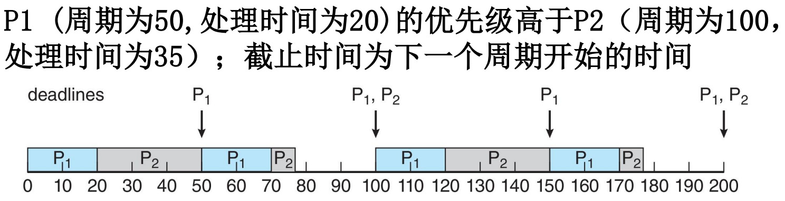
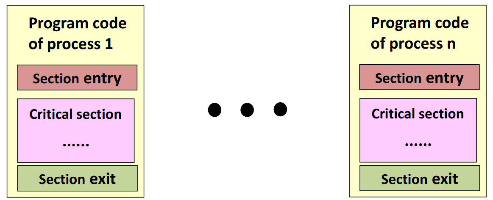
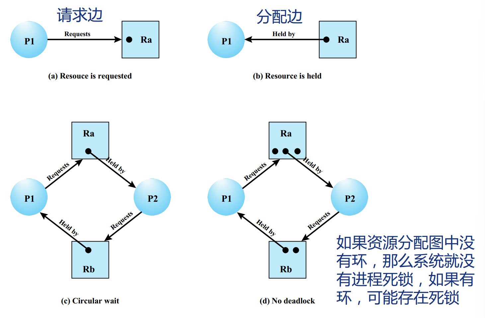

# 操作系统

## 绪论

1. 操作系统：在硬件和应用之间的软件层

   * 操作系统是管理硬件资源、控制程序运行、改善人机界面和为应用软件提供支持的一种系统软件。

   操作系统的作用：

   - 执行用户程序，使解决用户问题更容易；
   - 使计算机系统便于使用；
   - 以有效的方式使用计算机硬件；

2. 对称多处理器（SMP）：每个处理器都参与完成操作系统的所有任务

   非对称处理：每个处理器都有各自特定的任务

   

3. 非统一内存访问（NUMA）：

   

4. 操作系统的执行

   - 引导程序：初始化系统、加载内核的简单代码（位于固件）；
   - 内核加载；
   - 启动系统守护进程（在内核之外提供的服务）；

6. 双模式操作：

   

   * 由硬件提供模式位

   

7. 虚拟化：虚拟化技术使用软件，在计算机硬件上创建一个抽象层，能够将单台计算机的硬件元素（处理器、内存、存储等）分成多个虚拟计算机（通常称为虚拟机（VM））。每个虚拟机都会运行自己的操作系统（OS），其行为就像一台独立的计算机，即使它只在一部分实际底层计算机硬件上运行。

   

8. 定时器：

   - 定时器设置为在一段时间后中断计算机（时钟中断）；
   - 保留一个由物理时钟递减的计数器，由操作系统设置计数器（特权指令）。当计数器为零时，产生一个中断；
   - 在调度进程之前设置，以重新控制或终止超出分配时间的程序；
   
8. OS 的发展和分类：

   手工操作系统：其实是没有操作系统

   批处理操作系统

   * 单道批处理系统：将作业按顺序组织成批，由监控程序使用
   * 多道批处理系统：多道程序并发

   分时操作系统：轮流为各个用户服务

   实时操作系统：紧急任务优先

   > 多道批处理系统 vs 分时操作系统
   >
   > 多道批处理的目的是榨干硬件资源，同时处理 `作业A（CPU密集型）` + `作业B（I/O密集型）`
   >
   > 分时操作系统的目的是提升交互体验，为每个任务轮流分配时间片

9. 宏内核：将操作系统的主要功能模块都作为系统内核，运行在核心态

   * 优点：高性能
   * 缺点：内核代码庞大，结构混乱，难以维护

   微内核：只把最基本的功能保留在内核

     - 优点：内核功能少，结构清晰，方便维护
     - 缺点：需要频繁地在核心态和用户态之间切换，性能低

   

## 中断和异常

1. 中断：来自**硬件设备**的处理请求

   * 响应方式：异步，产生原因和当前执行指令无关，如程序被磁盘读打断
   * 处理机制：持续，对应用程序透明

   异常：**非法指令**或者其他原因导致当前指令执行失败（如：内存出错）后的处理请求

   * 响应方式：同步，产生和当前执行或试图执行的指令相关
   * 处理机制：**杀死或重新**执行

   系统调用：**应用程序**主动向操作系统发出的服务请求

   * 响应方式：异步或同步
   * 处理机制：等待和继续

2. 中断（设备产生、异步）

   - 可屏蔽：设备产生的信号，通过中断控制器与处理器相连，可被暂时屏蔽（如，键盘、网络事件）
   - 不可屏蔽：一些关键硬件的崩溃（如，内存校验错误）

   异常（软件产生、同步）

   - 错误：如缺页异常（可恢复）、段错误（不可恢复）等
   - 陷阱：无需恢复，如断点（int 3）、**系统调用**（int 80）
   - 中止：严重的错误，不可恢复（机器检查）

## 进程

1. 定义：执行中的程序，**==资源分配和调度的基本单位==**

2. 进程控制块（PCB）：

   - 进程描述信息：进程标识符PID、用户标识符UID
   - 进程控制和管理信息：
     - CPU、磁盘、网络流量使用情况统计...
     - ==**进程当前状态**==：就绪态/阻塞态/运行态...
   - 资源分配清单：使用的文件、使用的内存区域、使用的I/O设备
   - 处理机相关信息：PSW、PC等等各种寄存器的值（用于实现进程切换）

   特点：

   * PCB是进程存在的**==唯一标志==**
   * 当进程被创建时，**操作系统**为其创建PCB，当进程结束时，会回收其PCB。
   * 操作系统对进程进行管理工作所需的信息都存在PCB中
   * **==PCB位于内核空间==**

3. 进程的组成：

   - **PCB**：包含进程描述信息、进程控制和管理信息、资源分配清单、处理机相关信息
   - 程序段：程序的代码（指令序列）
   - 数据段：运行过程中产生的各种数据（如：程序中定义的变量）

****

### 进程状态模型

1. 两状态进程模型

   <table rules="none" align="center">
   	<tr>
   		<td>
   			<center>
                   
   				<br/>
   				<font color="AAAAAA">两状态进程模型</font>
   			</center>
   		</td>
   		<td>
   			<center>
                   
   				<br/>
   				<font color="AAAAAA">两状态排队模型</font>
   			</center>
   		</td>
   	</tr>
   </table>

   进程创建的原因：

   - 新批处理任务：操作系统通过批处理作业控制流来接收任务，通常这些任务保存在磁带或磁盘上。当操作系统准备好接受新工作时，它会读取下一组作业控制命令。
     
   - 交互式登录：用户通过终端登录到系统。
     
   - 由操作系统创建以提供服务：操作系统可以创建一个进程来代表用户程序执行功能，而无需用户等待（例如，一个控制打印的进程）。
     
   - 由现有进程生成：为了模块化或利用并行性的目的，用户程序可以指示创建多个进程。

2. 五状态模型

   <table rules="none" align="center">
   	<tr>
   		<td>
   			<center>
                   
   				<br/>
   				<font color="AAAAAA">五状态进程模型</font>
   			</center>
   		</td>
   		<td>
   			<center>
                   
   				<br/>
   				<font color="AAAAAA">五状态排队模型1（单阻塞队列）</font>
   			</center>
   		</td>
   		<td>
   			<center>
                   
   				<br/>
   				<font color="AAAAAA">五状态排队模型2（多阻塞队列）</font>
   			</center>
   		</td>
   	</tr>
   </table>

   - 运行态：占有CPU，并在CPU上运行
     
   - 就绪态：已经具备运行条件，但由于没有空闲CPU，而暂时不能运行
     
   - 阻塞态：因**等待某一事件**而暂时不能运行
     
   - 创建态：进程正在被创建，操作系统为进程分配资源、初始化PCB
     
   - 终止态：进程正在从系统中撤销，操作系统会回收进程拥有的资源、撤销PCB

4. 进程挂起

   交换需求：

   * 将内存中的一个进程的一部分或者全部移到磁盘上
   * 当内存中没有进程处于就绪状态时，操作系统将阻塞的进程交换到磁盘中，进入挂起队列（进程挂起需要消耗CPU资源，只有当CPU空闲时才执行挂起）

   <table rules="none" align="center">
   	<tr>
   		<td>
   			<center>
                   
   				<br/>
   				<font color="AAAAAA">单挂起状态进程模型</font>
   			</center>
   		</td>
   		<td>
   			<center>
                   
   				<br/>
   				<font color="AAAAAA">双挂起状态排队模型</font>
   			</center>
   		</td>
   	</tr>
   </table>
   
   特征：
   
   * 进程不能立即执行
   * 进程不一定在等待一个事件
     * 阻塞态一定是在等待一个事件，比如说一个信号或者I/O；挂起可能是用户手动暂停，无等待事件
   
   * 为阻止该进程执行，可通过代理使其处于挂起状态
     * 进程本身
     * 父进程
     * 操作系统
   * **==除非代理显式地命令系统进行状态轮换，否则该进程无法从这一状态转移。==**
   
   进程挂起的原因：
   
   * 交换：操作系统需要释放足够的主内存，以便引入一个准备执行的进程。
   * 其他操作系统原因：操作系统可能会挂起一个后台或实用程序进程，或者一个被怀疑导致问题的进程。
   * 用户交互请求：用户可能希望暂停程序的执行，以便进行调试或与资源使用相关。
   * 定时：一个进程可能会定期执行（例如，一个会计或系统监控进程），并在等待下一个时间间隔时被挂起。
   * 父进程请求：父进程可能希望挂起一个子进程的执行，以便检查或修改被挂起的进程，或协调各个子进程的活动。

### 进程管理

1. 进程管理中的数据结构：

   * 内存表：记录虚拟地址和物理地址之间的映射关系
   * I/O表：记录 I/O 端口被哪个进程使用
   * 文件表：记录进程打开的文件
   * 进程表：记录系统中的所有进程

   

2. 进程控制——执行模式

   1. 用户模式
      * 非特权模式
      * 用户程序运行在该模式下
   2. 系统模式
      * 特权模式
      * 也被称为控制模式和内核模式
      * 内核模式指的是操作系统内核，是操作系统中重要的系统功能

   模式切换：

   - 如果没有中断等待处理器：
     - 进入取指阶段并获取当前进程中当前程序的下一条指令

   - 如果有中断等待处理器：
     - 将程序计数器设置为中断处理程序的起始地址
     - 从用户模式切换到内核模式，以便中断处理代码可以包含特权指令

3. 进程的创建流程：

   1. 为新进程分配唯一的PID
   2. 为进程分配空间
   3. 初始化进程控制块
   4. 设置适当的链接
      * 调度队列链接：将新进程插入就绪队列（若资源就绪）或阻塞队列（若需等待事件）。
      * 父子进程关系：维护进程树结构（如父进程的`children`链表指向子进程）。
   5. 创建或扩展其他数据结构

4. 内核与用户进程的交互

   

   1. 独立内核：操作系统内核作为一个**独立的实体**运行在用户进程之上，与用户进程完全隔离
      * 用户进程通过**系统调用**请求内核服务
   2. OS功能在用户进程内：操作系统功能（如进程调度、内存管理）**嵌入用户进程**中，用户进程与内核功能的界限模糊化。
      * 进程切换由用户态和内核态协作完成
   3. OS功能为独立进程：操作系统功能以**独立进程形式**运行
      * 系统服务进程与其他进程通过**进程间通信**协作

5. 进程在内存中的分布：

   

   * 用户空间：全局变量、局部变量、动态内存、代码片段
   * 内核空间：PCB、内核代码

#### 重要函数

1. ``Getpid()``

   通过PCB获得进程id

   
   
2. ``fock()``

   * 进程创建是通过内核系统调用，``fork()``

   在内核模式下执行以下操作：

   1. 为新进程在进程表中分配一个槽位
   2. 为子进程分配一个唯一的进程ID
   3. 复制父进程的进程映像，除了任何共享内存
   4. 增加父进程拥有的任何文件的计数器，以反映现在还有一个额外的进程也拥有这些文件
   5. 将子进程分配到就绪运行状态
   6. 返回子进程的ID号给父进程，并给子进程返回0值

   

   **返回值**：

   1. 负值：创建子进程失败
   2. 零 ：返回到新创建的子进程
   3. 正值：返回到父进程或调用者。该值包含新创建的子进程的进程ID 

   在内核中的行为：

   1. 完全复制父进程
   2. 更新子进程的 **PID**，设置子进程 **Running time** 为 0
   3. **父进程增加孩子链表，子进程增加父进程指针**
   4. 创建新的进程结点，加入到双向链表中

   

   在用户空间中的行为：完全复制

   

   最终行为：获得返回值

   

   在创建进程后，内核可以作为调度程序例程的一部分执行以下操作之一：

   - 停留在父进程中
   - 将控制权转移给子进程
   - 将控制权转移给另一个进程

3. ``exec*()``

   * ``exec*()``  指的是一组函数。在 Linux 中，有以下内容

     ```c
     #include <unistd.h>
     
     extern char **environ;
     
     int execl(const char *path, const char *arg, ...);
     int execlp(const char *file, const char *arg, ...);
     int execle(const char *path, const char *arg, ..., char *const envp[]);
     int execv(const char *path, char *const argv[]);
     int execvp(const char *file, char *const argv[]);
     int execve(const char *path, char *const argv[], char *const envp[]);
     ```

     其中只有execve是真正意义上的系统调用，其它都是在此基础上经过包装的库函数

   作用：据指定的文件名找到可执行文件，并用它来取代调用进程的内容

   * exec 函数族的函数执行成功后不会返回，因为调用进程的实体，包括代码段，数据段和堆栈等都已经被新的内容取代，只留下进程ID等一些表面上的信息仍保持原样。只有调用失败了，它们才会返回一个-1，从原程序的调用点接着往下执行。

   调用exec的情况：

   1. 每当有进程认为自己不能为系统和用户做出任何贡献了，他就可以发挥最后一点余热，调用任何一个exec，让自己以新的面貌重生；
   2. 或者，更普遍的情况是，如果一个进程想执行另一个程序，它就可以fork出一个新进程，然后调用任何一个exec，这样看起来就好像通过执行应用程序而产生了一个新进程一样。

   > **写时拷贝技术**：fork 会将调用进程的所有内容原封不动的拷贝到新产生的子进程中去，这些拷贝的动作很消耗时间，而如果fork完之后我们马上就调用exec，这些辛辛苦苦拷贝来的东西又会被立刻抹掉，这看起来非常不划算，于是人们设计了一种"写时拷贝（copy-on-write）"技术，使得fork结束后并不立刻复制父进程的内容，而是到了真正实用的时候才复制，这样如果下一条语句是exec，它就不会白白作无用功了，也就提高了效率。

   开始的行为：搜索目标文件

   

   结束的行为：更新用户态空间的内容、寄存器的值

   

4. 进程终止 `exit()`, `wait()`, `abort()`

   * `exit()`：进程执行最后一条语句，然后使用 `exit()` 系统调用请求操作系统删除它。
     * 进程的资源由操作系统释放
     
   * `wait()`：父进程可以使用 `wait()` 系统调用等待子进程的终止。该调用返回**终止进程的状态信息和 `pid`**；
   
   * `abort()`：父进程可以使用 `abort()` 系统调用终止子进程的执行。这样做的一些原因：
     - 子进程已超出分配的资源
     
     - 不再需要分配给子进程的任务
     
     - 父进程正在退出，如果父进程终止，操作系统不允许子进程继续
     
       > 如果其父进程已终止，则某些操作系统不允许子进程存在。如果进程终止，则其所有子进程也必须终止。
       >
       > - 级联终止。所有子女、孙辈等均被终止。
       > - 终止由操作系统启动。

   * > 正常情况下：子进程由父进程创建，子进程再创建新的进程。父子进程是一个异步过程，父进程永远无法预测子进程的结束，所以，当子进程结束后，它的父进程会调用 `wait()` 或 `waitpid()` 取得子进程的终止状态，回收掉子进程的资源。
   
     孤儿进程：父进程结束了，而它的一个或多个子进程还在运行，那么这些子进程就成为孤儿进程。子进程的资源由 init 进程（进程号 PID = 1）回收。
   
     僵尸进程：子进程退出了，但是父进程没有用 `wait` 或 `waitpid` 去获取子进程的状态信息，那么子进程的进程描述符仍然保存在系统中，这种进程称为僵尸进程。
   
     * ==注意：unix提供了一种机制保证父进程知道子进程结束时的状态信息。这种机制是：在每个进程退出的时候，内核会释放所有的资源，包括打开的文件，占用的内存等。但是仍保留一部分信息(进程号PID，退出状态，运行时间等)。直到父进程通过wait或waitpid来取时才释放。==
     * 危害：
       1. 如果父进程不调用wait或waitpid的话，那么保留的信息就不会被释放，其进程号就会被一直占用，但是系统所能使用的进程号是有限的，如果大量产生僵尸进程，将因没有可用的进程号而导致系统无法产生新的进程，这就是僵尸进程的危害
       2. 孤儿进程是没有父进程的进程，它由init进程循环的wait()回收资源，init进程充当父进程。因此孤儿进程并没有什么危害。

   

   * `Wait() + exit()` 从子进程角度看：
   
     1. 清理大部分已分配的内核空间内存。
     2. 清理所有用户空间内存。
     3. 通过 SIGCHLD 通知父进程。
   
     
   
   * `Wait() + exit()` 从父进程角度：
   
     1. 默认情况下，每个进程都不会响应SIGCHLD信号。当调用 `wait()` 时，内核为进程设置了一个信号处理程序。
     
     2. `wait()` 系统调用会阻塞进程，
     
     3. 当SIGCHLD信号到来时，将调用信号处理程序。（注意：由于父进程仍然在系统调用中，而不是原始程序代码中，父进程在某种意义上仍然被阻塞）
     
        SIGCHLD的默认处理方式：
     
        1. 接受并移除SIGCHLD；
        2. 销毁发送信号的子进程。
     
     4. 然后信号处理程序被移除，即进程再次忽略SIGCHLD。它返回到之前正在执行的代码，回到用户空间。（这就是为什么 `wait()` 系统调用会等待任何一个子进程的原因。）
     
     5. 最后，`wait()`系统调用的返回值是终止子进程的进程ID（PID）。


### 进程间通信

#### 共享内存


- 希望通信的进程之间共享的内存区域，通信双方需要同时映射共享内存到自己的进程内；
- 通信由**用户进程**控制，而不是由操作系统控制；
  - 操作系统强制隔离，防止进程访问彼此的内存。因此，为了运行共享内存，操作系统会移除这个限制。因此，操作系统将不再管理对这个区域的操作
- 主要问题是提供一种机制，允许用户进程在访问共享内存时**同步**其操作；

（为方便说明问题，下面默认以生产者消费者问题为例讨论）

****

1. 无界缓冲区：理论上无限（依赖内存或存储资源）

   * 生产者永远不等待
   * 缓冲区空时阻塞，消费者等待新数据

2. 有界缓冲区：固定大小

   有界缓冲的两个要求：

   1. 生产者和消费者必须**互斥**访问缓冲区，确保同一时刻仅有一个进程（生产者或消费者）操作缓冲区的同一位置。
   2. 当缓冲区已满时，生产者必须阻塞等待直到有空位；当缓冲区为空时，消费者必须阻塞等待直到有数据。

##### 应用示例

1. 共享内存数据结构：

   ```c
   #define BUFFER_SIZE 10        // 定义缓冲区容量（有界缓冲区核心）
   typedef struct { ... } item;  // 数据单元结构体（如包含数据包、消息等内容）
   item buffer[BUFFER_SIZE];     // 循环数组实现的共享缓冲区
   int in = 0;                   // 生产者指针：指向下一个可写入的空位
   int out = 0;                  // 消费者指针：指向第一个待读取的满位
   ```

   - 缓冲区满的条件：`(in + 1) % BUFFER_SIZE == out` 。（预留一个空位避免`in == out`时无法区分空/满状态）
   - 缓冲区空的条件：`in == out`
   - 写入操作（生产者）：将数据放入`buffer[in]`，然后更新`in = (in + 1) % BUFFER_SIZE`
   - 读取操作（消费者）：从`buffer[out]`取数据，然后更新`out = (out + 1) % BUFFER_SIZE`

   示例：

   ```c
   // 生产者模块
   item next_produced;                   // 定义待生产的数据单元
   while (true) {                        // 持续生产循环
       /* produce an item saved in next_produced */  // 生产数据（如传感器采集、日志生成）
       while (((in + 1) % BUFFER_SIZE) == out) 
           ;                             // 缓冲区满时自旋等待（实际应优化为阻塞）
       buffer[in] = next_produced;       // 将数据写入缓冲区当前in指针位置
       in = (in + 1) % BUFFER_SIZE;      // 环形缓冲区指针更新
   }
   --------------------------------------------------------------------------------------
   // 消费者模块
   item next_consumed;                   // 定义待消费的数据单元
   while (true) {                        // 持续消费循环
       while (in == out) 
           ;                             // 缓冲区空时自旋等待（实际应优化为阻塞）
       next_consumed = buffer[out];      // 从缓冲区当前out指针位置读取数据
       out = (out + 1) % BUFFER_SIZE;    // 环形缓冲区指针更新
       /* consume the item in next_consumed */  // 处理数据（如渲染页面、存储日志）
   }
   ```

2. Linux 共享内存

   基本操作：

   

   **Key ID：**

   ```c
   #include <sys/shm.h>
   key_t ftok(const char *pathname, int id);	// key_t is of type int. ftok() convert a pathname and a project identifier to an IPC key
   key_t key = ftok("/home/myshm", 0x27);
   
   if(key == -1) {
       perror("ftok()");
   } else
       printf("key = 0x%x\n", key);
   ```

   **Create：**得到一个共享内存标识符或创建一个共享内存对象

   ```c
   /* shmget() allocates a shared memory segment */
   /* upper bound of size: 1.9G */
   int shmget(key_t key, int size, int shmflg);
   
   int shmid = shmget(IPC_PRIVATE, 4096, IPC_CREAT|IPC_EXCL|0660);
   if(shmid == -1) {
       perror("shmget()");
   }
   ```

    `shmflg`：

    * `IPC_CREAT`：如果内核中不存在键值与key相等的共享内存，则新建一个共享内存；如果存在这样的共享内存，返回此共享内存的标识符
    * `IPC_CREAT|IPC_EXCL`：如果内核中不存在键值与key相等的共享内存，则新建一个消息队列；如果存在这样的共享内存则报错
   
   **Attach：**把共享内存区对象映射到调用进程的地址空间

    ```c
    void *shmat(int shmid, const void *shmaddr, int shmflg);
   
    void *shmptr = shmat(shmid, 0, 0);		// shmaddr=0: attaching address is decided by kernel
    if(shmptr == (void *)(-1))
        perror("shmat()");
    ```
   
    **Detach：**断开共享内存连接

    ```c
    int shmdt(const void *shmaddr);
   
    if(shmdt(shmptr) == -1)
        perror("shmdt()");
    ```
   
    **Release**：完成对共享内存的控制

    由参数CMD对标识符为shmid的共享内存进行对应操作

    ```c
    int shmctl(int shmid, int cmd, struct shmid_ds *buf);
   
    if (shmctl(shmid, IPC_RMID, 0) == -1)
        perror("shmctl()");
    ```
   
    - `IPC_STAT`：得到共享内存的状态，把共享内存的`shmid_ds`结构复制到buf中
    - `IPC_SET`：改变共享内存的状态，把buf所指的`shmid_ds`结构中的uid、gid、mode复制到共享内存的`shmid_ds`结构内
    - `IPC_RMID`：删除这片共享内存
   
3. Linux 共享内存单生产者-单消费者模型：

   demo 请看 alg.shm。注意，要在 Linux 系统下才能运行

#### 消息传递


消息传递：进程之间相互通信，无需借助共享变量

IPC设施提供两种操作：

* Send 发送（消息）
* Receive 接收（信息）

****

##### 直接通信


- 进程之间必须明确命名：
  - 发送（P，消息）- 向进程P发送消息
  - 接收（Q，消息）- 从进程Q接收消息
- 链路的特性：
  - 链接是自动建立的
  - 链路仅与一对通信进程相关联
  - 每对之间只存在一个链接
  - 链路可能是单向的，但通常是双向的
- 这种通信方式展示了寻址的对称性，即发送和接收进程必须指定对方，以便通信。
- 也可以采用寻址的非对称性，即只要发送者指定接收者，而接收者不需要指定发送者

##### 间接通信


- 通过邮箱或者端口来发送和接收消息
  - 每个邮箱都有一个唯一的id
  - 进程只有在共享邮箱时才能通信
- 通信链路的特性：
  - 仅当进程共享公共邮箱时才建立链接
  - 链接可能与许多进程相关联
  - 每对进程可以共享多个通信链路
  - 链路可以是单向的或双向的
- 操作
  - 创建新邮箱（端口）
  - 通过邮箱发送和接收邮件
  - 删除邮箱

- 基本体定义为：
  - 发送（A，消息） - 将消息发送到邮箱A
  - 接收（A，消息） - 从邮箱A接收消息
- 邮箱共享
  - P1、P2和P3共享邮箱A
  - P1，发送；P2和P3接收
  - 消息接受会发生冲突，解决方案：
    - 允许链接最多与两个进程关联
    - 一次只允许一个进程执行接收操作
    - 允许系统任意选择接收器。通知发送方接收者是谁。

- 邮箱所有者
  - 邮箱可以被进程拥有；
  - 邮箱被操作系统拥有；
  - 邮箱可以转移；

##### 同步（阻塞）

消息传递可以是阻塞的，也可以是非阻塞的

- 阻塞被认为是同步的
  - 阻塞发送——在接收进程或者邮箱收到消息之前，发送进程阻塞；
  - 阻塞接收——在消息可用之前，接收进程将被阻塞

- 非阻塞被认为是异步的
  - 非阻塞发送——发送进程发送消息并继续执行；
  - 非阻塞接收——接收进程接收：
    - 有效消息或空消息

- 可能有不同的组合
  - 如果发送和接收都是阻塞的，双方之间有一个交会。

##### 缓存

**缓存**是附加在通信链路上的**消息暂存区**，其本质是一个**先进先出（FIFO）队列**。

 队列实现的三种容量模式：

* **零容量：**链路**无缓存空间**，发送方必须**阻塞等待**接收方就绪（同步通信）
* **有限容量：**队列最大长度为`n`，满队列时发送方阻塞（异步通信+流量控制）
* **无限容量：**队列理论上无限长，发送方永不阻塞

#### 管道通信

##### 普通管道（匿名管道）

**==普通管道：无法从创建它的进程外部访问==**。通常，父进程创建管道并使用它与它由 `fork()` 创建的子进程通信。

* **==单向传输==**：普通管道允许标准生产者-消费者风格的通信。生产者写入一端（管道的写入端）；使用者从另一端（管道的读取端）读取数据。因此，普通管道是**==单向的==**；
* 需要通信进程之间的==**父子关系**==；
* 在 **Windows** 系统中称为**匿名管道**

管道创建：Unix 中，普通官道的创建采用函数 `pipe(int fd[2])`，其中 `int fd[]` 为文件描述符，`fd[0]` 为读出端，`fd[1]` 为写入端


创建流程：


##### 命名管道

命名管道：它提供一个路径名与之关联，以FIFO的文件形式存储于文件系统中

* 通信进程之间**==不需要父子关系==**（命名管道是一个文件，只要可以访问该路径，就能够通过FIFO相互通信）
* **==多个进程==**可使用命名管道进行通信；
* 通信是**双向的**，但是是半双工。

> 注意区分全双工和半双工：
>
> * 两者的通信都是双向的
> * 全双工指的是双方可**同时**进行双向数据传输
> * 半双工指的是**同一时间只能单向传输**

##### 消息队列 vs. 管道


1. **消息队列**：
   * 传输单元：固定大小的预定义消息
   * 工作方式：进程 P1 通过 Send 原语发送完整消息包，消息完整存入队列；进程P2通过Receive获取整个消息包
2. **管道**：
   - 传输单元：无结构的字节流
   - 工作方式：P1通过Write持续写入字节流到环形缓冲区，P2通过Read按需读取任意字节量

#### 套接字

**用于客户机与服务器间的通信（网络通信）**

三种类型的套接字：

- 面向连接（TCP）
- 无连接（UDP）
- MulticastSocket类–数据可以发送到多个收件人

特点：常用和高效，但属于分布式进程之间的一种低级形式的通信。

- 套接字只允许在通信线程之间交换无结构的字节流，客户机或服务器程序需要自己加上数据结构

#### 远程过程调用

远程过程调用（RPC）：允许程序像调用本地函数一样调用另一台计算机上的函数，抽象了底层网络通信细节。

## 进程调度

CPU调度是多道程序操作系统的基础

对于支持内核线程的操作系统，操作系统实际调度的是内核级线程而非进程

为什么需要调度：

* I/O密集型：程序运行的大部分时间是CPU在等待I/O，CPU负载不高。
* CPU密集型：I/O可以很快完成，而CPU还有很多运算要处理，CPU负载高。

****

### 调度层次

| 调度类型 | 要做什么                                                   | 调度发生位置          | 发生频率 | 对进程状态的影响                 | 作用               |
| -------- | ---------------------------------------------------------- | --------------------- | -------- | -------------------------------- | ------------------ |
| 长程调度 | 从后备队列中选择合适的作业将其调入内存，并为其**创建进程** | 外存→内存（面向作业） | 最低     | 无→创建态→就绪态                 | 控制了系统的并发度 |
| 中程调度 | 从**挂起**队列中选择合适的进程将其数据调回内存             | 外存→内存（面向进程） | 中等     | 挂起态→就绪态（阻塞挂起→阻塞态） |                    |
| 短程调度 | 从**就绪**队列中选择一个进程为其分配处理机                 | 内存→CPU              | 最高     | 就绪态→运行态                    |                    |

<table rules="none" align="center">
	<tr>
		<td>
			<center>
                
				<br/>
				<font color="AAAAAA">调度层次和五状态模型之间的对应关系</font>
			</center>
		</td>
		<td>
			<center>
                
				<br/>
				<font color="AAAAAA">作业三级调度示意图</font>
			</center>
		</td>
		<td>
			<center>
                
				<br/>
				<font color="AAAAAA">调度层次图</font>
			</center>
		</td>
	</tr>
</table>

### 调度程序


### 调度准则

1. CPU 利用率：CPU “忙碌”的时间占总时间的比例
   $$
   \text {利用率} = \frac{\text{忙碌的时间}}{\text{总时间}}
   $$
   

2. 系统吞吐量：单位时间内完成作业的数量
   $$
   系统吞吐量 = \frac{\text{总共完成了多少道作业}}{\text{总共花了多少时间}}
   $$
   

3. 周转时间：从作业被提交给系统开始，到作业完成为止的这段时间间隔。
   $$
   \text{周转时间} = \text{作业完成时间} - \text{作业提交时间} \\
   平均周转时间 = \frac{\text{各作业周转时间之和}}{\text{作业数}}
   $$

   $$
   带权周转时间 = \frac{\text{作业周转时间}}{\text{作业实际运行的时间}} = \frac{\text{作业完成时间} - \text{作业提交时间}}{\text{作业实际运行的时间}} \\
   
   平均带权周转时间 = \frac{\text{各作业带权周转时间之和}}{\text{作业数}}
   $$

4. 等待时间：处于等待处理机状态时间之和

   * 等待时间不包括等待 I/O 的时间

   $$
   \text{等待时间 = 周转时间 - 执行时间 \ (- I/O 操作时间)}\\
   平均等待时间 = \frac{各作用等待时间之和}{作业数}
   $$

5. 响应时间：指从用户提交请求到**首次**产生响应所用的时间

### 调度算法

1. 先来先服务（FCFS）：按照作业到达的先后顺序进行服务

   算法思想：公平性

   抢占性：非抢占

   优点：公平、算法实现简单

   缺点：排在长作业后面的短作业需要等待很长时间，**==周转时间很大==**

   饥饿性：不会饥饿

   护航效应：短作业都在等长作业

   

   

2. 最短作业优先（SJF）：最短的作业优先得到服务

   算法思想：追求最少的平均等待时间，最少的平均周转时间

   抢占性：SJF 是非抢占（SRTN 是抢占）

   优点：**“最短的”**平均**==等待时间==**、平均**==周转时间==**

   * 严格来讲，是**抢占式**的最短作业优先得到的平均等待时间、平均周转时间最少；

     应该加上一个条件“在所有进程同时可运行时，采用 SJF 调度算法的平均等待时间、平均周转时间最少”，这是可以**数学证明**的

   * “最短的”意思是不是一定最短，但相比于其他算法来说，依然是较少的

   缺点：不公平。对短作业有利，对长作业不利。可能产生饥饿现象。另外，作业/进程的运行时间是由用户提供的，并不一定真实，不一定能做到真正的短作业优先

   饥饿性：会导致饥饿

   > 如果题目中未特别说明，所提到的“短作业/进程优先算法”默认是非抢占式的。

   

3. 抢占式最短作业优先（最短剩余时间优先）（SRTN）：每当有进程加入就绪队列改变时就需要调度，如果新到达的进程剩余时间比当前运行的进程剩余时间更短，则由新进程抢占处理器，当前运行进程重新回到就绪队列。

   强占性：SRTN 是抢占（SJF 是非抢占）

   饥饿性：会导致饥饿

   

4. 轮转调度：

   算法思想：公平地、轮流地为各个进程服务，让每个进程在一定时间间隔内都可以得到响应

   抢占性：抢占的

   优点：公平；响应快，适用于分时操作系统；

   缺点：由于高频率的进程切换，因此有一定开销；不区分任务的紧急程度。

   饥饿性：不会导致饥饿

   时间片选择特点：

   * 如果时间片太大，使得每个进程都可以在一个时间片内就完成，则时间片轮转调度算法退化为先来先服务（FCFS）算法，并且会增大进程响应时间。因此时间片不能太大。
   * 如果时间片太小，会导致进程切换过于频繁，系统会花大量的时间来处理进程切换，从而导致实际用于进程执行的时间比例减少。可见时间片也不能太小。
   * 随着时间片大小的增加，平均周转时间不一定会改善

5. 优先级调度：调度时选择优先级最高的作业

   算法思想：随着实时操作系统的出现，一些的应用场景需要根据任务的紧急程度来决定处理顺序

   抢占性：抢占式、非抢占式都有

   优点：用优先级区分紧急程度、重要程度，适用于实时操作系统。可灵活地调整对各种作业/进程的偏好程度。

   缺点：若源源不断地有高优先级进程到来，则可能导致饥饿

   解决方案：老化 – 随着时间的推移，进程的优先级会增加

   饥饿性：会导致饥饿

   **==一定要注意：优先数大，优先级高；还是优先数小，优先级高==**

6. 多级反馈队列

   

   

   

### 多处理器调度

1. 处理器类型类型：

   * 非对称多处理器（AMP）：仅**主处理器**控制调度，从处理器被动执行任务（主从式调度）
   * 对称多处理器（SMP）：无主从之分，所有处理器地位平等（自调度）

2. 调度评价指标：

   - 负载均衡：尽可能让每个CPU都同等忙碌
     - 推迁移：一个特定任务定期检查状态并重新平衡
     - 拉迁移：空闲处理器从繁忙处理器中拉取等待任务
   - 处理器亲和性：尽量让一个进程调度到同一个CPU上运行，以发挥CPU中缓存的作用（Cache）
     - 软亲和：由进程调度程序尽量保证“亲和性”
     - 硬亲和：由用户进程通过系统调用，主动要求操作系统分配固定的CPU，确保“亲和性”

   

   * 非统一内存访问（NUMA）：CPU 调度器和内存放置算法协同工作

3. 调度策略：

   1. 公共就绪队列：所有 CPU 共享同一个就绪进程队列（位于内核区），每个 CPU 运行时调度程序，从公共就绪队列中选择一个进程运行

      - 每个CPU访问公共就绪队列时需要上锁（确保互斥）

      优点：负载均衡

      缺点：各个进程频繁地换CPU运行，“亲和性”不好

   2. 私有就绪队列：每个CPU都有一个私有就绪队列。CPU空闲时运行调度程序，从私有就绪队列中选择一个进程运行

      优点：处理机亲和性

   <table rules="none" align="center">
   	<tr>
   		<td>
   			<center>
                   
   				<br/>
   				<font color="AAAAAA">公共就绪队列</font>
   			</center>
   		</td>
   		<td>
   			<center>
                   
   				<br/>
   				<font color="AAAAAA">私有就绪队列</font>
   			</center>
           </td>
   	</tr>
   </table>

多线程多核处理器：每个核心都有 $> 1$ 个硬件线程（就是超线程），如果一个线程发生内存暂停，切换到另一个线程

<table rules="none" align="center">
	<tr>
		<td>
			<center>
                
				<br/>
				<font color="AAAAAA">逻辑图</font>
			</center>
		</td>
		<td>
			<center>
                
				<br/>
				<font color="AAAAAA">硬件图</font>
			</center>
        </td>
	</tr>
</table>

- 处理器多核的多线程有两种方法：
  - 细粒度：多线程在更细粒度级别上（通常是指令周期）切换线程，线程之间的切换很小；
    - 通过**高频切换**掩盖单线程停顿（类似“不停接活，避免闲着”）
  - 粗粒度：粗粒度线程，线程一直在处理器上执行，直到一个长延迟时间如内存停顿发生，线程之间的切换成本高；
    - 专注**跑满当前线程**，仅当“卡死”时才切换（类似“干完再转场”）
  
- 多线程多核处理器需要两个级别的调度：一个级别由操作系统调度；另一个级别是指定每个核心如何运行哪个硬件线程；

  ```mermaid
  graph LR  
      A[操作系统调度] -->|分配软件线程到核心| B(物理处理器核心)  
      B --> C[硬件调度器]  
      C -->|按细/粗粒度策略| D[执行硬件线程指令]

### 硬实时和软实时系统

1. 定义：

   - 硬实时：一个任务必须在它的截止期限前完成
   - 软实时：有一个相关的截止期限，但不是强制性的

2. 最小化延迟：

   * 中断延迟：从收到中断到中断处理例程开始的时间；
   * 调度延迟：从停止一个进程到启动另一个进程所需的时间量称为调度延迟，提供抢占式内核；

   >  实时系统的事件驱动性质要求，事件发生时，系统应尽快地响应和服务它；

3. 实时系统的优先级调度：

   对于实时调度，调度器必须支持抢占式、基于优先级的调度。但只能保证软实时性；

   对于硬实时系统，还必须提供满足截止期限的能力，需要添加新的调度特征：周期性进程需要以固定的时间间隔使用 CPU

   - 具有处理时间 t、截止日期 d、周期 p
   - $0 \leq y \leq d \leq p$
   - 定期任务的速率为 $\frac{1}{p}$

   

   采用准入控制：
   - 如果能保证进程完成，准入进程
   - 如果不能保证任务能够在截止期限前完成，拒绝请求；

4. 单调速率调度：采用抢占的、**静态优先级**的策略，调度周期性任务。每个周期性任务分配一个优先级

   优先级是根据其周期的倒数来分配的：

   * 周期越短：优先级越高
   * 周期越长：优先级越低

   特点：

   * 是软实时调度系统
   * CPU 利用率有限

   示例：

   

   错过截止日期的情况：进程 P1 的周期为 50，执行时间为 25；进程 P2 对应的值是 80，35；

   * 进程2并不能在截止时间80完成；

   

5. 最早截止期限优先调度（EDF）：采用**抢占的**、按照截止期限**动态分配优先级**；截止期限越早，优先级越高；截止期限越晚，优先级越低；

   - 单调速率调度的优先级是固定的，而EDF是动态的；
   - EDF 调度不要求进程是周期执行的，也不要求进程的CPU时间是固定的，唯一的要求是：进程在编程可运行时，应给出它的截止时间。
   - 理论最佳，CPU利用率会到100%。然而，实际中，由于进程的上下文切换和中断处理的代价，CPU利用率无法达到100%。

   

## 线程

1. 线程的定义：线程是 CPU 调度的基本单元；

   **==线程 vs 进程：线程是CPU调度的基本单元，进程是分配资源的基本单位==**

2. 一个进程的多线程可以在不同处理器上同时执行

   * **调度的基本单元**由进程变为了线程
   * 每个线程都有状态，上下文切换的单位变为了线程

3. 每个线程拥有自己的栈，内核中也有为线程准备的内核栈

   共享内容：代码段、堆内存、全局变量

   私有内容：局部变量

   <table rules="none" align="center">
   	<tr>
   		<td>
   			<center>
                   
   				<br/>
   				<font color="AAAAAA">线程模型</font>
   			</center>
   		</td>
   		<td>
   			<center>
                   
   				<br/>
   				<font color="AAAAAA">线程在用户态内存的布局</font>
   			</center>
   		</td>
   	</tr>
   </table>

4. 单线程模型和多线程模型

   <table rules="none" align="center">
   	<tr>
   		<td>
   			<center>
                   
   				<br/>
   				<font color="AAAAAA">单线程进程</font>
   			</center>
   		</td>
   		<td>
   			<center>
                   
   				<br/>
   				<font color="AAAAAA">多线程进程</font>
   			</center>
   		</td>
   	</tr>
   </table>

5. 多线程的优点

   * 响应性：如果部分线程被阻塞，仍可以继续执行
   - 资源共享：线程共享进程资源，比进程共享内存或消息传递更容易
   - 经济：比进程创建、上下文切换开销更低。
   - 可扩展性：线程可以利用多核体系结构；

6. 并发与并行；

   并发：在单核系统上并发执行，通过快速的CPU调度进程，支持多个任务，提供并行的假象，任意时刻只能执行一个任务；

   并行：多核系统上的并行执行，可以同时执行多个任务；

   <table rules="none" align="center">
   	<tr>
   		<td>
   			<center>
                   
   				<br/>
   				<font color="AAAAAA">并发模型</font>
   			</center>
   		</td>
   		<td>
   			<center>
                   
   				<br/>
   				<font color="AAAAAA">并行模型</font>
   			</center>
   		</td>
   	</tr>
   </table>

7. 线程控制块：

   

8. 线程类型：

   **==用户级线程和内核级线程最大的区别是：内核意识不到用户级线程的存在，但是可以意识都内核级线程的存在==**

   1. 用户级线程（ULT）：

      
   
      * 管理线程的所有工作都由应用程序完成；
   * **内核意识不到线程的存在**
      * 采用第三方库来创建（如 pthreads）

      优势：

      - 线程切换不需要内核模式权限
      - 调度可以是特定于应用程序的
      - 用户级线程可以在任何操作系统上运行
   
      劣势：

      * 在典型的操作系统中，很多系统调用都会引起阻塞。因此，在ULT执行一个系统调用时，不仅会阻塞线程，也会阻塞进程中的**==所有==**的线程。
      * 在纯ULT策略中，内核以**进程为调度单位**，内核一次只把一个进程分配给一个处理器，因此一个进程中只有一个线程可以执行。
   
   2. 内核线程：

      

      * 线程的管理工作由内核完成

      **==优势==**：

      - 内核可以同时把同一个进程中的多个线程调度到多个处理器；
      - 进程中的一个线程阻塞，内核可以调度同一个进程中的另一个线程；
      - 内核线程自身也可以是多线程（内核线程自身可以并发）

      劣势：

      * 把控制权从一个线程传送到同一个进程内的另一个线程时，需要切换内核模式。

9. 线程模型：

   1. 多对一模型：多个用户级线程映射到一个内核级线程。且一个进程只被分配一个内核级线程。

      

      优点：用户级线程的切换在用户空间即可完成，不需要切换到核心态，线程管理的系统开销小，效率高。

      缺点：当一个用户级线程被阻塞后，整个进程都会被阻塞，并发度不高。多个线程不可在多核处理机上并行运行。

      **==再次强调重点：操作系统只“看得见”内核级线程==，因此只有==内核级线程才是处理机分配的单位。==**

   2. 一对一模型：一个用户级线程映射到一个内核级线程。每个用户进程有与用户级线程同数量的内核级线程。

      

      优点：当一个线程被阻塞后，别的线程还可以继续执行，并发能力强。多线程可在多核处理机上并行执行。

      缺点：一个用户进程会占用多个内核级线程，线程切换由操作系统内核完成，需要切换到核心态，因此线程管理的成本高，开销大。

   3. 多对多模型：$ n $ 用户及线程映射到 $ m $ 个内核级线程（$ n \geq m $）。每个用户进程对应 $ m $ 个内核级线程

      

      优点：克服了多对一模型并发度不高的缺点（一个阻塞全体阻塞），又克服了一对一模型中一个用户进程占用太多内核级线程，开销太大的缺点。

      特点：内核级线程中可以运行任意一个有映射关系的用户级线程代码，只有两个内核级线程中正在运行的代码逻辑都阻塞时，这个进程才会阻塞。

      - **==用户级线程是“代码逻辑”的载体==**
      - **==内核级线程是“运行机会”的载体==**

## 同步

1. 竞争条件：多个进程并发访问和操作同一数据并且执行结果与访问顺序有关；

   - 为了防止竞争条件，需要确保一次只有一个进程访问关键数据；

   - 竞争条件在操作系统中普遍存在；

   - 竞争条件是不确定的；

2. 临界区问题：考虑 $n$ 个进程 $\{P_0，P_1，\cdots, P_{N-1} \}$ 的系统每个进程都有**一段代码**，称为临界区：当一个进程处于临界区时，其他进程不得处于其临界区；

   * 每个进程必须在入口区请求进入临界区的许可，临界区之后是退出区，然后是剩余区（==**入口阻止其他进程，而不是临界区**==）

   * 临界区：访问临界资源的**一段代码**

     

3. ==**临界区问题解决访问的要求：**==

   1. **互斥**：一次只能有一个进程在临界区中
   2. **推进**：临界区空闲时，应运行一个进程访问
   3. **有限等待**：要在有限的时间内进入临界区，保证不会饥饿

### 硬件同步方案

#### 中断禁用

1. 中断禁用：关中断

   * 进程间的切换需要中断。中断禁用之后，就可以确保进程不被抢占。因此通过禁用CPU中断响应，确保当前进程在临界区内不可被抢占

   优点：简单、高效

   缺点：

   1. 不适用于多处理机
      * 关中断只能关闭单个处理机。因此多处理器中断禁用会很耗时，因为消息要传递到所有处理器。消息传递会延迟进入临界区，并降低系统效率
   2. 如果系统时钟是通过中断来更新的，也会受到影响

   特点：

   1. 多是单处理器系统应用
   2. 通常被非抢占式内核采用

#### 特殊机器指令

1. test_and_set 指令

   * test_and_set 指令是用**硬件实现**的，执行过程是原子的。

   下面是用 C 语言描述的指令逻辑

   ```cpp
   // 布尔型共享变量 lock 表示当前临界区是否被加锁
   // true 表示已加锁，false 表示未加锁
   bool TestAndSet (bool *lock){
       bool old;
       old = *lock;        // old用来存放lock原来的值
       *lock = true;       // 无论之前是否已加锁，都将lock设为true
       return old;         // 返回lock原来的值
   }
   
   // 以下是使用 TSL 指令实现互斥的算法逻辑
   while (TestAndSet (&lock)); // "上锁"并"检查"
   临界区代码段
   lock = false;               // "解锁"
   剩余区代码段
   ```

   下面是满足有限等待的逻辑：

   ```cpp
   do {
       waiting[i] = true;      // 声明自身等待
       key = true;             // 本地变量初始化
       
       // 自旋等待直到获得锁且自己非等待态
       while (waiting[i] && key) 
           key = test_and_set(&lock); // 原子操作抢锁
       
       waiting[i] = false;     // 清除等待标记（准备进入）
   
       /* ===== 临界区 ===== */ 
   
       // 寻找下一个可运行的等待进程
       j = (i + 1) % n;        // 从i+1开始环形搜索
       while (j != i && !waiting[j]) 
           j = (j + 1) % n;    // 跳过非等待进程
   
       if (j == i)             // 无其他等待者
           lock = false;       // 直接释放锁
       else                    // 找到等待者j
           waiting[j] = false; // 唤醒进程j（允许其进入）
   
       /* ===== 剩余区 ===== */ 
   } while (true);
   ```

   对一个并发系统，`waiting[j] = false` 唤醒进程 `j` 后，当进程 `j` 上处理机时，waitting 条件被打破，可用进入临界区。

   因此，这段代码确保当一个进程退出临界区时，会循环扫描数组，并根据这一顺序指派第一个等待进程作为下次进入临界区的进程。因此，任何等待进入临界区的进程只需等待n-1次。

2. compare_and_swap 指令

   * compare_and_swap 指令是用**硬件实现**的，执行过程是原子的。

   下面是用 C 语言描述的指令逻辑

   ```cpp
   // Swap 指令的作用是交换两个变量的值
   compare_and_swap  (bool *a, bool *b) {
       bool temp;
       temp = *a;
       *a = *b;
       *b = temp;
   }
   
   // 以下是用 Swap 指令实现互斥的算法逻辑
   // lock 表示当前临界区是否被加锁
   bool old = true;
   while (old == true)
       compare_and_swap  (&lock, &old);
   临界区代码段...
   lock = false;
   剩余区代码段...
   ```

   从逻辑上来讲，和 test_and_set  无太大区别。

3. 特殊机器指令的优势：

   * 适用于单个处理器或共享主存的多个处理器上的任意数量的进程
   * 简单且易于验证
   * 可用于支持多个临界区；每个临界区都可以由自己的变量定义;

   特殊机器指令的劣势：

   * 采用忙等待，因此当进程等待访问临界区时，它会继续消耗处理器时间
   * 当一个进程离开临界区并且有多个进程在等待时，可能会发生饥饿（不满足有限等待）
   * 可能出现死锁;

### 互斥锁

（因为使用忙等待，又称为**自旋锁**）

1. `acquire()` 和 `release()`（原子操作）：

   ```cpp
   acquire() {
       while (!available)
       	;					// 忙等待
       available = false;		// 获得锁
   }
   
   release() {
   	available = true;		// 释放锁
   }
   ```
   
2. 优势：当进程在等待锁时，没有上下文切换

   * 多处理系统中，若上锁的时间短，则等待代价很低

   劣势：使用忙等待

   特点：常用于多处理器系统，一个核忙等，其他核照常工作，并快速释放临界区

### 软件同步方案

#### 严格备选

1. 定义：严格备选算法要求进程之间，按照预设的严格交替顺序访问临界资源，通过软件逻辑而非硬件原子指令实现互斥。

   

2. 下面以两个进程为例：使用共享变量 `turn` 来实现进程交替

   进程 0：

   ```cpp
   while (TRUE) {
     while( turn != 0 )	// 没轮到进程 0 就忙等待
       ; 		// entry
     critical_section();	// 临界区
     turn = 1;		// exit
     non_critical_section();
   }
   ```

   进程 1：

   ```cpp
   while (TRUE) {
     while( turn != 1 )	// 没轮到进程 1 就忙等待
       ; 		// entry
     critical_section();	// 临界区
     turn = 0;		// exit
     non_critical_section();
   }
   ```

   两个进程必须严格的轮流进入临界区

   

3. 缺点：

   * 忙等待，浪费 CPU 资源

   * 一个进程无法连续两次进入临界区

   * 违背进步原则

     > 如果此时允许进入临界区的进程是 P0，而 P0 一直不访问临界区，那么虽然此时临界区空闲，但是并不允许 P1 访问。

#### Peterson

```cpp
bool flag[2];      // 表示进入临界区意愿的数组（表达意愿）
int turn = 0;      // turn 表示轮到哪个进程进入临界区（表示谦让）

------------------------
P0 进程:
flag[0] = true;   // P0 表示想要进入临界区
turn = 1;         // 让给 P1 进入临界区
while (flag[1] && turn==1); // 如果 P1 也想进入临界区，且轮到 P1，则 P0 等待
critical section; 
flag[0] = false;  
remainder section; 

------------------------
P1 进程:
flag[1] = true;   // P1 表示想要进入临界区
turn = 0;         // 让给 P0 进入临界区
while (flag[0] && turn==0); // ⑨ 如果 P0 也想进入临界区，且轮到 P0，则 P1 等待
critical section; 
flag[1] = false;  
remainder section;
```

进程将表现得像一个绅士：如果你想进入，我会让你先

优势：同时满足互斥、进步、有限等待

劣势：

* 忙等待

* 优先级倒置（高优先级让给低优先级执行）

  

### 信号量

1. 两个重要操作：

   ``wait()``、``Signal()``（也被称为 `P()`、`V()`）

   * 两者都是原子操作

2. 信号量简单实现：

   * 忙等待实现

   ```cpp
   int S = 1;  // 初始化整型信号量s，表示当前系统中可用的打印机数量
   
   void wait (int S) {  // wait 原语，相当于“进入区”
       while (S <= 0);  // 如果资源数不够，就忙等待
       S = S - 1;       // 如果资源数够，则占用一个资源
   }
   
   void signal (int S) {  // signal 原语，相当于“退出区”
       S = S + 1;        // 使用完资源后，在退出区释放资源
   }

3. 计数信号量定义：

   * 解决忙等待问题

   ```cpp
   struct semaphore {
       int count; // 每个信号量都有一个整数值和一个进程队列
       queueType queue; // 当进程必须等待信号量时，就添加到进程队列中（解决忙等待）
   };
   
   void semWait(semaphore s) {
       s.count--;
       if (s.count < 0) {
           block(S.L);		// 如果剩余资源数量不够，运行态进入阻塞态
       }
   }
   
   void semSignal(semaphore s) {
       s.count++;
       if (s.count <= 0) {
   		wakeup(S.L)		// 释放资源后，从 queue 中唤醒一个进程
       }
   }
   ```

4. 二元信号量定义：

   ```cpp
   struct binary_semaphore { 
     enum {zero, one} value; 
     queueType queue; 
   }; 
   
   void semWaitB(binary_semaphore s) 
   { 
     if (s.value == one)  
       s.value = zero; 
     else { 
         /* place this process in s.queue */; 
         /* block this process */; 
     } 
   } 
   void semSignalB(semaphore s) 
   { 
     if (s.queue is empty()) 
       s.value = one; 
     else { 
         /* remove a process P from s.queue */; 
         /* place process P on ready list */; 
     } 
   } 
   ```

   **信号量和互斥锁**：

   * 互斥锁具有所有者，仅持有者能解锁
   * 信号量无所有者，任意线程可增减信号量

5. 用硬件互斥机制，实现 `wait` 和 `signal` 的原子性

   1. 忙等待方案（特殊指令实现）：但 `semWait` 和 `semSignal` 操作相对较短，因此涉及的忙等待量很小。适用多处理器系统。

      ```cpp
      semWait(s)
      {
          while (compare_and_swap(s.flag, 0, 1) == 1)
              ;		// 申请锁，访问临界资源
          s.count--;
          if (s.count < 0) {
              资源不足，放入等待队列;
              阻塞进程，同时释放锁 (set s.flag to 0);
          }
          s.flag = 0;		// 释放锁
      }
      
      semSignal(s)
      {
          while (compare_and_swap(s.flag, 0, 1) == 1)
              ;		// 申请锁，访问临界资源
          s.count++;
          if (s.count <= 0) {
              从阻塞队列中移出一个进程;
              将进程放入等待队列;
          }
          s.flag = 0;			// 释放锁
      }
      ```

   2. 单处理器系统（中断禁用实现）：可在 `semWait` 或 `semSignal` 操作时禁止中断。由于持续时间相对较短意味着这种方法是合理的。

      ```cpp
      semWait(s)
      {
          inhibit interrupts;		// 中断禁用，访问临界资源
          s.count--;
          if (s.count < 0) {
              资源不足，放入等待队列;
              阻塞进程，同时开中断
          }
          else
              allow interrupts;		// 开中断
      }
      
      semSignal(s)
      {
          inhibit interrupts;
          s.count++;
          if (s.count <= 0) {
              从阻塞队列中移出一个进程;
              将进程放入等待队列;
          }
          allow interrupts;
      }
      ```

### 管程

1. 管程是一个由以下部分组成的**软件模块**：

   1. 局部数据：描述共享资源状态的变量（如缓冲区、计数器）；
   2. 一组过程（方法）：定义对共享资源的操作（如生产、消费），确保互斥访问；
   3. 初始化代码：设置资源的初始状态（如初始化缓冲区大小）；

2. 特性：

   * **==管程属于抽象数据类型，封装了数据和一组保证互斥的函数==**（现在已经作为一个程序库实现）
   * 管程中移出只能有一个进程处于活跃状态
   * 同步机制：通过条件变量（`wait()`/`signal()`）实现线程间的协作，避免忙等待（**使用信号量实现同步**）
   * 局部数据变量只能由管程的方法（函数）访问，不能被任何外部程序访问。
   * 管程不会出现死锁

   

3. 条件变量：用于定义附件的同步机制。

   * 多个条件变量可以实现多个同步

   实现函数：

   * `x.wait()`：调用该操作的线程/进程会被挂起，进入与 `x` 关联的等待队列，直到其他线程调用 `x.signal()` 唤醒它。
   * `x.signal()`：唤醒一个因 `x.wait()` 阻塞的线程。如果没有进程在等待，那么，信号被丢弃
     * ==与信号量的 `signal` 不同，没有 `s = s + 1` 的操作==

   条件变量与P、V操作中信号量的区别：条件变量是一种信号量，但不是P、V操作中纯粹的计数信号量，没有与条件变量关联的值，**不能像信号量那样积累供以后使用**，仅仅起到维护等待进程队列的作用。因此在使用条件变量 x 时，通常需要定义一个与之配套使用的整型变量 x-count 用于记录条件变量x所维护等待队列中的进程数。

   `signal` 操作有两种可能性：

   * 唤醒并等待
     1. P调用 `x.signal()` 唤醒Q后，P自身立即进入等待状态（如进入入口队列或其他条件队列）；
     2. Q获得管程锁，开始执行其后续操作；
     3. Q退出管程后，P被重新唤醒，继续执行未完成的操作。
   * 唤醒并继续
     1. P调用 `x.signal()` 唤醒Q后，P继续执行，直至退出管程或主动等待其他条件；
     2. Q被唤醒后进入管程入口队列，等待P释放锁；
     3. P退出管程后，Q获得锁并执行。

   唤醒并等待实现方式：

   ```cpp
   void x.wait() {
       x_count++;              // 步骤1：增加等待线程计数
       if (next_count > 0) {   // 步骤2：检查是否有线程在next队列等待
           signal(next);       // 情况A：唤醒一个因signal()挂起的线程
       } else {
           signal(mutex);      // 情况B：无挂起线程，释放管程入口锁
       }
       wait(x_sem);            // 步骤3：在x_sem上阻塞，等待被唤醒
       x_count--;              // 步骤4：唤醒后减少等待计数
   }
   
   void x.signal() {
       if (x_count > 0) {        // 检查是否有线程在等待x的条件
           next_count++;         // 步骤1：增加因signal挂起的线程计数
           signal(x_sem);        // 步骤2：唤醒一个等待在x上的线程（如进程A）
           wait(next);           // 步骤3：当前线程（进程B）在next信号量上挂起
           next_count--;         // 步骤4：被唤醒后减少挂起计数
       }
       // 若x_count <= 0，直接返回（无需操作）
   }
   ```

4. 示例：

   * 场景假设：进程P在管程内调用 `x.signal()`，且存在另一进程Q因调用 `x.wait()` 正在条件变量x的等待队列中阻塞。
   * 核心矛盾：唤醒Q后，管程的​**​互斥性​**要求同一时间仅允许一个进程执行，因此需协调P和Q的执行顺序，避免两者同时活跃于管程内。

### 经典同步问题

## 死锁

1. 定义：各进程互相等待对方手里的资源，导致各进程都阻塞，无法向前推进的现象。

2. **==死锁的条件：==**

   * 互斥：一次只有一个进程使用一个资源，其他进程不能访问分配给其他进程的资源；
   * 占有等待：当一个进程等待其他进程时，继续占有已分配的资源
   * 非抢占：不能强行抢占进程已占有的资源
   * 循环等待：存在一个闭合的进程链，每个进程至少占有此链中下一个进程所需的一个资源

3. 资源分配图

   

   **==如果同类资源数大于1，则即使有循环等待，也未必发生死锁。但如果系统中每类资源都只有一个，那循环等待就是死锁的充分必要条件了。==**

4. 处理死锁的方法：

   - 死锁预防：确保至少有一个**死锁条件**不成立
   - 死锁避免：操作系统事先得到有关进程申请资源和使用资源的**额外信息**并基于此来判断进程是否应等待
   - 死锁检测：允许系统进入死锁状态，然后检测和恢复；

   > 鸵鸟策略：忽略该问题，并假装系统中从未发生死锁；
   >
   > - 解决死锁的代价很高，采用鸵鸟策略：不采取任何措施，能获得更高的性能。
   > - 死锁发生的概率很低，就算发生死锁对用户的影响并不大，所以可以采用鸵鸟策略。

### 死锁预防

死锁预防：使死锁的四个条件之一无效

1. 互斥：

   1. 可共享资源（例如只读文件）不需要互斥
   2. 把互斥资源改造成允许共享使用的资源

   缺点：通常不能否定互斥条件来预防死锁，必须保留不可共享的资源；

2. 占有等待：

   1. 在开始执行之前请求并分配其所有资源（只占有不等待）
   2. 仅当进程在未分配任何资源时才允许进程请求资源（只等待，不占用等待）

   缺点：

   * 资源利用率可能比较低，存在资源已经分配，但是长时间不用
   * 发生饥饿，长久等待需要的资源（尤其是需要多个常用资源）；

3. 无抢占：

   1. 如果持有某些资源的进程请求另一个无法立即分配给它的资源，那么当前持有的所有资源都将被释放（隐式释放）。被抢占资源被添加到进程正在等待的资源列表中。只有当进程能够恢复其原有的资源以及它所请求的新资源时，才会重新启动进程
      * **==和破坏占有等待的区别是==**：
   2. 当某个进程需要的资源被其他进程所占有的时候，可以由操作系统协助，将想要的资源强行剥夺。这种方式一般需要考虑各进程的优先级（比如：剥夺调度方式，就是将处理机资源强行剥夺给优先级更高的进程使用）

   缺点：

   * 释放已获得的资源可能造成前一阶段工作的失效。
   * 若采用方案一，意味着只要暂时得不到某个资源，之前获得的那些资源就都需要放弃，以后再重新申请。如果一直发生这样的情况，就会导致进程饥饿。

4. 循环等待：

   1. 强制所有类型的资源进行完全排序，并要求每个进程以递增的顺序请求资源；
      * 原理分析：一个进程只有已占有小编号的资源时，才有资格申请更大编号的资源。按此规则，已持有大编号资源的进程不可能逆向地回来申请小编号的资源，从而就不会产生循环等待的现象。

   缺点：

   * 进程实际使用资源的顺序可能和编号递增顺序不一致，会导致资源浪费；

### 死锁避免

1. 安全序列：如果系统按照这种序列分配资源，则每个进程都能顺利完成。

   安全状态：只要能找出一个安全序列，系统就是安全状态

   * ==系统处于安全状态，就**一定不会**发生死锁==

   * ==系统处于不安全状态，就**可能发生**死锁==

   * ==发生死锁，系统**一定是**在不安全状态==

     

2. 死锁避免：

   - 资源分配拒绝：如果分配可能导致死锁，则不授予进程增量资源请求
   - 进程启动拒绝：如果其需求可能导致死锁，则不启动进程

3. 资源分配图算法：仅当将申请边转换为分配边不会导致资源分配图中形成循环时，才能授予请求，利用环检测算法，检查安全性;

   * 每种资源类型只有一个实例

   

4. 银行家算法数据结构：

   设 n = 进程数，m = 资源类型数。

   - Available：长度为 m 的向量，表示每种资源类型的可用实例数量。如果 Available[j] = k，则有 k 个资源类型 $R_j$ 的实例可用；
   - Max: n × m 矩阵，定义每个进程的最大需求。如果 Max[i, j] = k，那么进程 $P_i$ 最多需要请求 k 个 $R_j$ 资源
   - Allocation：n × m 矩阵，定义每个进程现在分配的每种资源类型的实例数量。如果 Allocation[i, j] = k，则 $P_i$ 当前已分配 k 个 $R_j$ 资源
   - Need：n × m 矩阵，表示每个进程还需要的剩余资源。如果 Need[i, j] = k，那么 $P_i$ 还可能申请 k 个 $R_j$ 实例来完成它的任务。
     - $\text{Need[i, j]} = \text{Max[i, j]} - \text{Allocation[i, j]}$

5. 银行家算法步骤：

   1. 检查此次申请是否超过了之前声明的最大需求数（正确性检测）
   2. 检查此时系统剩余的可用资源是否还能满足这次请求（正确性检测）
   3. 试探着分配，更改各数据结构
   4. 用安全性算法检查此次分配是否会导致系统进入不安全状态

   安全性算法步骤：检查当前的剩余可用资源是否能满足某个进程的最大需求，如果可以把该进程加入安全序列，并把该进程持有的资源全部回收。不断重复上述过程，看最终是否能让所有进程都加入安全序列。

6. 死锁避免的限制

   - 必须事先声明每一个进程请求的最大资源；
   - 所讨论的进程必须是无关的，即他们的执行顺序必须没有任何同步要求的限制；
   - 分配的资源数量必须是固定的；
   - 在占有资源时，进程不能退出；

### 死锁检测

1. 死锁检测算法：

   1. 单实例：使用资源等待图，看看是否存在循环

      

   2. 采用类似银行家算法，找是否存在安全序列即可

2. 缺点

   - 频繁的检测会耗费相当多的处理器时间；

3. 死锁恢复策略

   1. 取消所有的死锁进程
   2. 把每个死锁进程回滚到前面定义的某些检查点，并重新启动所有进程，要求在系统中构建回滚和重启机制
   3. 连续取消死锁进程直到不再存在死锁，
      * 所取消的进程的顺序应基于某种最小代价原则
   4. 连续抢占资源直到不再存在死锁；
      * 需要使用一种基于代价的选择方法，且需要在抢占后重新调用检测算法

   最小代价原则：

   - 目前为止消耗的处理器时间最少；
   - 目前为止产生的输出最少；
   - 预计剩下的时间最长；
   - 目前为止分配的资源总量最少；
   - 优先级最低；

## 物理内存

### 进程的内存映像

1. 内存映像：

   * 常量在代码段（代码和常量都是只读的）

   * 数据段：初始化为非零值的全局/静态变量。

     BSS 段：初始化为0或未初始化的全局变量和静态变量（静态变量被视为与全局变量相同）

     * 对于程序来说，BSS只是一组符号。空间尚未分配。一旦进程开始执行，空间将被分配给进程。

   <table rules="none" align="center">
   	<tr>
   		<td>
   			<center>
                   
   				<br/>
   				<font color="AAAAAA">内存布局（王道）</font>
   			</center>
   		</td>
   		<td>
   			<center>
                   
   				<br/>
   				<font color="AAAAAA">内存布局（课件）</font>
   			</center>
   		</td>
   	</tr>
   </table>

2. 可能发生段错误的原因：

   

### 内存管理

1. 内存保护：可以通过使用一对基址寄存器和界限地址寄存器定义进程的可访问地址

   <table rules="none" align="center">
   	<tr>
   		<td>
   			<center>
                   
   				<br/>
   				<font color="AAAAAA">内存布局</font>
   			</center>
   		</td>
   		<td>
   			<center>
                   
   				<br/>
   				<font color="AAAAAA">保护流程</font>
   			</center>
   		</td>
   	</tr>
   </table>

   加载基地址寄存器和界限寄存器的指令具有特权性，只能在内核模式下运行，也只有操作系统可以加载基地址寄存器和界限地址寄存器

2. 地址绑定

   1. 编译时绑定：如果内存位置先验已知，则可以生成绝对代码
      * 如事先知道用户进程驻留在内存地址 R 处，那么生成的编译代码就可以从该位置开始并向后延伸；如果起始位置更改，则必须重新编译代码
   2. 加载时绑定：如果编译时内存位置未知，则必须生成可重定位代码。绑定会延迟到加载时才进行。
      * 如果开始地址发生变化，那么只需要重新加载用户代码以合并更改的值
   3. 执行时绑定：如果进程在执行期间可以从一个内存段移动到另一个内存段，则绑定延迟到运行时
      * 需要硬件支持地址映射（重定位寄存器）

   一个程序从编译到装入内存的流程：

   

3. 逻辑地址空间和物理地址空间

     - 逻辑地址：由CPU生成；也称为虚拟地址；
     - 物理地址：内存单元看到的地址，即加载到内存地址寄存器的地址
     - 逻辑地址空间：程序生成的所有逻辑地址的集合
     - 物理地址空间：逻辑地址对应的所有物理地址的集合

   地址绑定与物理地址、逻辑地址之间的关系

   | 阶段       | 描述                                                         |
   | ---------- | ------------------------------------------------------------ |
   | 编译时绑定 | 生成相同的逻辑地址和物理地址；                               |
   | 加载时绑定 | 生成相同的逻辑地址和物理地址；                               |
   | 执行时绑定 | 逻辑（虚拟）地址和物理地址在执行时地址绑定生成不同的逻辑地址和物理地址； |

4. 内存管理单元（MMU）：在运行时将虚拟地址映射到物理地址的硬件设备

   

5. 交换：内存空间紧张时，系统将内存中某些进程暂时换出外存，把外存中某些已具备运行条件的进程换入内存

   * 属于**==中程调度==**

   

### 连续内存分配

1. 连续内存分配：为进程分配一块物理地址连续的内存空间

   内存通常分为两个分区：
     - 一个用于常驻操作系统，操作系统可以放在低内存，也可以放在高内存，这取决于中断向量的位置。一般中断向量位于低内存，因此操作系统一般也放在低内存
     - 另一个用于用户进程，用户进程保存在高内存中；

   使用重定位寄存器保护用户进程之间互不影响

   

2. 连续内存分配方式：

   1. 固定分区：操作系统占据内存中的固定部分；用户空间划分为若干个固定大小的分区，在每个分区中只装入一道作业

      * 注意，分区大小可能相等，也可能不相等

      缺点：

      - 分区的数量在系统生成阶段已经确定，因而限制了系统中活动（未挂起）进程的数量；
      - 由于分区是在系统生成阶段事先设置的，因而小作业不能有效利用分区空间

      

   2. 可变分区：各种大小的孔散布在内存中，当一个进程到达时，从一个足以容纳它的孔中分配内存

      > 孔：可用内存块

      特点：

      * 进程退出将释放其分区，**相邻的空闲分区合并**
      * 操作系统使用表维护以下信息：
        1. 分配的分区
        2. 空闲分区（孔）

      

3. 动态分区分配算法

   1. 首次适应（first-fit）：分配首个足够大的孔

      * 查找可以**==从头开始==**。一旦找到足够大的空闲孔，就停止
      * 首次适配算法不仅是最简单的，而且通常是**最好**和**最快的**；
      * 首次适配算法会使得内存的前端出现很多小空闲区

   2. 最优适应（best-fit）：分配最小孔（在足够大的前提下）

        * 必须搜索整个列表，除非按大小排序；

        - 生成最小的剩余孔

        - 最佳适配通常会产生很多小到无法满足任何内存分配请求的小块，需要更频繁的内存压缩；


   3. 最差适应（worst）：分配最大的孔（在足够大的前提下）

        - 产生最大的剩余孔。该孔可能比最优适应产生的较小剩余孔更为适用

        - 必须搜索整个列表；

   4. 邻近适应算法（next-fit）：在首次适应算法的基础上，每次都从上次查找结束的位置开始检索。

      * 不用每次都从低地址的小分区开始检索
      * 会使高地址的大分区也被用完

   性能：

   * 在速度和存储利用率方面，首次适应和最优适应优于最差适应。
   * 在利用空间方面：首次适应和最优适应在利用空间方面相当，但首次适应要快一些

4. 碎片

   - 外部碎片：存在**满足请求**的**总**内存空间，但它**不是连续**的；
   - 内部碎片：分配给进程的内存区域中，如果有未被使用的部分，就是内部碎片（分配内存 > 请求内存）

   紧缩技术：移动内存内容，将所有可用内存放在一个大块中

   * 只有在重新定位是动态的并且在运行时完成时，才可能进行紧缩；如果是静态重定位则无法移动

### 分段

1. 定义：按照程序自身的逻辑关系划分为若干个段，每个段都有一个段名，每段从0开始编址

   * 内存分配规则：以段为单位进行分配，每个段在内存中占据连续空间，但各段之间可以不相邻。

   * **==消除了内部碎片，但是产生外部碎片==**

2. 分段硬件

   * 分段地址映射由段表实现。

     段表的每个条目由段基地址和段界限构成

   

   * 分段从 0 号开始，所以在判断段号是否越界时，使用 "$\ge$" 符号

3. 地址转换：

   <table rules="none" align="center">
   	<tr>
   		<td>
   			<center>
                   
   				<br/>
   				<font color="AAAAAA">地址转换</font>
   			</center>
   		</td>
   		<td>
   			<center>
                   
   				<br/>
   				<font color="AAAAAA">地址转换</font>
   			</center>
   		</td>
   	</tr>
   </table>

   * 段号的位数决定了每个进程**最多**可以分几个段
   * 段内地址位数决定了每个段的**最大**长度是多少。

### 分页

1. 页帧：将**==物理内存==**分为固定大小的块，称为帧或页帧

   页：将**==逻辑内存==**也划分为大小相同的块，称为页或页面

   * **==消除了外部碎片，但仍有内部碎片==**
   * 页面大小或动态变化

2. 地址转换：

   - 页号：用作页表的索引，该页表包含物理内存中每页的基址
   - 页偏移量：与基址相结合，定义发送到内存单元的物理内存地址

   

3. 分页硬件：

   

   * **页表需要访问两次内存**：一次找页表，一次找数据

     段页式需要三次

4. 快表：

   

5. 有效内存访问时间

   假设访问内存需要100ns，计算在不同命中率下的有效访问时间（EAT）。

   已知条件：
   - 访问内存时间：100ns
   - TLB命中率：80%
   - 如果在 TLB 中找到所需的页面，则映射内存访问需要100ns
   - 如果没有在 TLB 中找到所需的页面，则需要两次内存访问，总时间为200ns

   计算步骤：

   $$
   \text{EAT} = 0.80 \times 100 + 0.20 \times 200 = 120 \text{ns}
   $$

6. 内存保护：使用有效位来保护

7. 共享页：将进程间可共享的内容用一个页共享

   

8. 分层页表

   * 只有顶层页表需要常驻内存，其他页表只有在被用到的时候才调入内存

   <table rules="none" align="center">
   	<tr>
   		<td>
   			<center>
                   
   				<br/>
   				<font color="AAAAAA">二级页表</font>
   			</center>
   		</td>
   		<td>
   			<center>
                   
   				<br/>
   				<font color="AAAAAA">二级页表寻址机制</font>
   			</center>
   		</td>
   	</tr>
   </table>

### 特殊页表

1. 哈希页表：处理超过32位地址空间的常用方法是使用哈希页表，并以虚拟页码作为哈希值。

   * 哈希页表的每一条目都包括一个链表的元素，链表用于连接发生碰撞的元素。每个元素有3个域∶（1）虚拟页码，（2）所映射的帧号，（3）指向链表中下一个元素的指针。

   工作流程：虚拟地址中的虚拟页号转换到哈希表中，用虚拟页号与链表中的每一个元素的第一个域相比较。如果匹配，那么相应的帧号（第二个域）就用来形成物理地址；如果不匹配，那么就对链表中的下一个节点进行比较，以寻找一个匹配的页号。

   

2. 倒排页表：与其每个进程都有一个页表并跟踪所有可能的逻辑页，不如跟踪所有物理页

   * 整个系统只有一个页表

   工作流程：每个反向页表的条目为一对<process-id，page-number>，其中 process-id用来作为地址空间的标识符。当需要内存引用时，由<process-id， page-number>组成的虚拟地址部分送交内存子系统。通过查找反向页表来寻找匹配。如果匹配找到，例如条目 i，那么就产生了物理地址<i，offset>。如果没有匹配，那么就是试图进行非法地址访问。

   * 增加了查找页表所需要的时间。可能需要查找整个表来寻求匹配。

   

   耗时问题：为了解决查找页表的大量耗时，可以使用哈希页表来将查找限制在一个或少数几个页表条目（可用使用 TLB 加速）。

   共享内存：使用虚拟地址到共享物理地址的映射

3. 伙伴系统：

   我们可以创建一个表格来模拟伙伴算法。

   | 时间  | 事件     | 请求大小 | 分配情况                     | 空闲情况            |
   | ----- | -------- | -------- | ---------------------------- | ------------------- |
   | Start | 初始状态 | -        | -                            | $2^{10}$            |
   | T1    | A请求    | 150B     | $2^8$(A)                     | $2^9$, $2^8$        |
   | T2    | B请求    | 100B     | $2^8$(A), $2^7$(B)           | $2^9$, $2^7$        |
   | T3    | C请求    | 50B      | $2^8$(A), $2^7$(B), $2^6$(C) | $2^9$, $2^6$        |
   | T4    | B释放    | -        | $2^8$(A), $2^6$(C)           | $2^9$, $2^7$, $2^6$ |
   | T5    | C释放    | -        | $2^8$(A)                     | $2^9$, $2^8$        |
   | T6    | A释放    | -        | -                            | $2^{10}$            |

   伙伴算法流程：

   1. 假设系统的可用空间容量 1024 B，则系统开始运行时，整个用户区是一个大小为 $2^{10}$B 的空闲分区。

   2. 系统运行过程中，由于不断分配和回收，将形成若干个不连续的空闲分区，将这些空闲分区按分区的大小进行分类。对于具有相同大小的所有空闲分区，单独设立一个空闲分区链。（该算法规定，无论是已分配分区还是空闲分区，所有分区大小均为 2 的 k 次幂（k为整数））

   3. 当需要为进程 A 分配大小为 150B 的分配分区时（$2^7 < 150 \le 2^8$），首先计算一个 $i$ 的值，使得（$2^{i-1} < 150 \le 2^i$），显然，计算得到 i = 8。

      接着，会在大小为 $2^i$ 的空闲分区链中查找。

      * 若找到，则将该空闲分区分配给进程 A。
      * 否则，表示大小为 $2^i$ 的空闲分区已耗尽，需要在大小为 $2^{i+1}$ 的空闲分区链中继续查找。
        * 若存在大小为 $2^{i+1}$ 的空闲分区，则将其等分为两个分区，这两个分区称为一对伙伴，其中一个用于分配，另一个加入大小为 $2^i$ 的空闲分区链。
        * 若不存在，则继续查找 $2^{i+2}$ 的空闲分区链，
          * 若找到则需要进行两次分割，分割称两个 $2^{i+1}$ 的分区，一个 $2^{i+1}$ 大小的分区加入到对应的空闲分区链中；另一个分区**继续分割**，分割成两个 $2^i$ 的分区，一个加入对应分区链中，一个分给进程。
          * 若仍然不存在，则继续查找，以此类推。

   4. 与一次分配可能要进行多次分割一样，一次回收也可能需要进行多次合并。

   

## 虚拟内存

1. 定义：程序不需要全部装入内存，运行时根据需要动态调入数据，若内存不够，还可以换出一些数据

   * 虚拟内存远大于物理内存
   * 允许多个进程共享地址空间

2. 虚拟地址空间：

   * 通常从地址0开始，连续地址直到空间结束
   * 同时，物理内存组织在页帧中，分配给进程的物理帧可以不连续；
   * MMU必须将逻辑页映射到物理页帧；

3. 使用虚拟内存共享库

   

### 请求调页

1. 页表机制：增加状态位、修改位、外存地址

   

   * valid 位位 0，则发生缺页中断

2. 缺页中断：每当要访问的页面不在内存时，便产生一个缺页中断，然后由操作系统的缺页中断处理程序处理中断。

   * 此时缺页的进程阻塞，放入阻塞队列，调页完成后再将其唤醒，放回就绪队列。

   处理流程：

   * 如果内存中有空闲块，则为进程分配一个空闲块，将所缺页面装入该块，并修改页表中相应的页表项。
   * 如果内存中没有空闲块，则由页面置换算法选择一个页面淘汰，若该页面在内存期间被修改过，则要将其写回外存。未修改过的页面不用写回外存。

   

   * 缺页异常处理完后重新启动导致缺页的指令
   * 快表中有的页面一定是在内存中的。若某个页面被换出外存，则快表中的相应表项也要删除，否则可能访问错误的页面。

3. 请求调页的性能：

   缺页错误处理时间有三个主要组成部分：

   - 处理缺页错误中断
   - 读入页面（大量时间）
   - 重新启动进程（少量时间）

   缺页错误概率 $p$: $0 \leq p \leq 1$​：有效访问时间 $ EAT = (1 - p) \times \text{内存访问时间} + p \times \text{缺页错误时间} $

   > 缺页错误的一系列动作：
   >
   > 1. 操作系统陷入
   > 2. 保存用户寄存器和进程状态
   > 3. 确定中断是否是缺页错误
   > 4. 检查页面引用是否合法，并确定页面在磁盘上的位置；
   > 5. 向空闲帧发出从磁盘读取的命令：
   >     a) 在此设备的队列中等待，直到读取请求得到服务；
   >     b) 等待设备寻道和/或延迟时间；
   >     c) 开始将页面传输到空闲帧；
   > 6. 在等待时，将CPU分配给其他用户（CPU调度，可选）
   > 7. 从磁盘I/O子系统接收中断（I/O完成）
   > 8. 保存其他用户的寄存器和进程状态（如果执行了第6步）
   > 9. 确定中断来自上述磁盘的；
   > 10. 更正页表和其他表，以表示所需页面现在已在内存中；
   > 11. 等待CPU再次分配到此进程；
   > 12. 还原用户寄存器、进程状态和新页表，然后恢复中断的指令

   例题：计算有效访问时间（EAT）

   已知条件：
   - 内存访问时间 = 200纳秒
   - 平均页面错误服务时间 = 8毫秒

   计算公式：
   $$
   EAT = (1 - p) \times 200 + p \times (8 \times 10^6) \\
   = 200 + p \times 7999800
   $$
   问题1：如果 1000 次访问中有一次导致页面错误，则：
   $$
   EAT = 8.2 \text{微秒}
   $$

   * 这是40倍的减速

   问题2： 如果希望性能下降 < 10%
   $$
   220 > 200 + 7999800 \times p \\
   即 \ 20 > 7999800 \times p \\
   得到 \ p < 0.0000025 
   $$

   - 也就是说每400000次内存访问中出现不多于一次缺页错误

### 页面置换

1. 页面置换流程

   1. 换出一个牺牲页
   2. 修改 valid 位
   3. 换入需要的页
   4. 修改新页的页表

   

   * **==使用修改位（或脏位）可减少页面传输的开销——只有修改过的页面才会写入磁盘==**

2. 先进先出置换算法（FIFO）：每次选择淘汰的页面是最早进入内存的页面

   <table rules="none" align="center">
   	<tr>
   		<td>
   			<center>
                   
   				<br/>
   				<font color="AAAAAA">分配三个内存块</font>
   			</center>
   		</td>
   		<td>
   			<center>
                   
   				<br/>
   				<font color="AAAAAA">分配四个内存块</font>
   			</center>
   		</td>
   	</tr>
   </table>

   Belady 异常：当为进程分配的物理块数增大时，缺页次数不减反增的异常现象。

   * **==只有 FIFO 算法会产生 Belady 异常。==**
   * FIFO算法虽然实现简单，但是该算法与进程实际运行时的规律不适应，因为先进入的页面也有可能最经常被访问。

3. 最优页面置换算法（OPT）：每次选择淘汰的页面将是**以后**在最长时间内不再被访问的页面，这样可以保证最低的缺页率

   * 难以实现，需要提前知道引用串的未来信息
   * 主要用于测量算法的性能（作为比较的 baseline）

   

4. 最近最久未使用置换算法（LRU）：每次淘汰的页面是最近最久未使用的页面

   

   LRU 实现：

   1. 计数器：为每个页表条目关联一个使用时间域，并为CPU添加一个逻辑时钟或计数器。每次内存引用都会递增时钟。
   2. 页码堆栈：页面被引用时，从堆栈中移除并放在顶部，确保最近使用的页面总是在堆栈的顶部，最近最少使用的页面总是在底部
      * 涉及到从堆栈中间删除条目，采用具有首指针和尾指针的双向链表来实现
      * 更新堆栈有点费时，但好处是不需要搜索
   3. 时间戳

5. 近似 LRU 算法：

   - 设置引用位：每个页表项增加1个硬件位（初始0），访问时由硬件自动置1（无需软件干预）

     ```text
     页1:1  页2:1  页3:0 → 知道页3未用，但不知道页1/2谁更旧
     ```

   - 额外引用位算法：为每个页面配置 8 位移位寄存器

     示例周期：

     | 周期 | 访问情况 | 移位寄存器变化          |
     | :--- | :------- | :---------------------- |
     | 0    | 未访问   | 00000000 → 00000000     |
     | 1    | 访问     | 00000000 → **1**0000000 |
     | 2    | 访问     | 10000000 → **1**1000000 |
     | 3    | 未访问   | 11000000 → **0**1100000 |

   * 第二次机会算法（时钟算法）：当选择一个页面时，检查其引用位。如果为0，直接置换该页面。如果为1，给此页面第二次机会，继续选择下一个FIFO页面。当一个页面获得第二次机会时，其引用位被清除。

     * 通常为FIFO，加上硬件提供的引用位
     * 指针向前移动直到找到一个引用位为 0 的页面，向前移动时，清除引用位。一旦找到牺牲页面，就置换该页面，并在循环队列的这个位置插入新页面

     

   * 增强型二次机会算法：采取有序配对（引用位、修改位）

     - （0，0）最近未使用未修改：要替换的最佳页面
     - （0，1）最近未使用但已修改：不太好，必须在置换之前将页面写出；
     - （1，0）最近使用但没有修改：可能很快会再次使用
     - （1，1）最近使用和修改的：可能很快会再次使用，需要在更换前将页面写出；

     算法规则：将所有可能被置换的页面排成一个循环队列

     * 第一轮： 从当前位置开始扫描到第一个（0，0）的帧用于替换。本轮扫描不修改任何标志位
     * 第二轮： 若第一轮扫描失败，则重新扫描，查找第一个（0，1）的帧用于替换。本轮将所有扫描过的帧访问位设为0
     * 第三轮： 若第二轮扫描失败，则重新扫描，查找第一个（0，0）的帧用于替换。本轮扫描不修改任何标志位
     * 第四轮： 若第三轮扫描失败，则重新扫描，查找第一个（0，1）的帧用于替换

6. 页面缓冲算法：系统保留一个空闲帧池（如总内存的 5%），当出现缺页错误时，立即从空闲池取帧加载目标页。异步处理牺牲帧，牺牲帧写入完成后归还空闲池

   * （扩展）维护一个修改过的页面列表，每当调页设备空闲时，就选择一个修改页面以写到磁盘上，然后重置它的修改位。这种方案增加了在需要选择置换时干净的且无需写出的页面的概率。

   * （另一种扩展）保留一个空闲帧池，并记住哪些页面在哪些帧内；如果在重用之前再次引用，则无需再次从磁盘加载内容；如果选择了错误的受害者帧，通常有助于减少惩罚

     换出逻辑：

     ```mermaid
     graph LR  
     A[换出页面 X] --> B[仅修改页表项 valid 位]
     B --> C[物理帧内容保持原状]
     C --> D[该帧移入空闲但保留内容的缓冲池]
     ```

     访存逻辑：

     ```mermaid
     graph TD
         A[缺页中断] --> B{查询缓存表}
         B -->|存在记录| C{内容是否有效}
         C -->|有效| D[直接重用物理帧]
         C -->|无效| E[从磁盘加载]
         B -->|无记录| E
     ```

### 帧分配

1. 固定分配：

   1. 平均分配：每个进程分配一样的帧数量
      * 例如，如果有93帧（在为操作系统分配帧之后）和 5 个进程，则为每个进程分配 18 帧。保留剩余的3帧作为空闲帧缓冲池。
   2. 比例分配：根据进程的大小进行分配。

   > 对平均分配或比例分配，一般高优先级进程与低优先级进程同样处理。为给予高优先级进程更多内存以加速执行，一种方案是，所采用的比例分配策略不是根据进程的相对大小，而是进行的优先级或大小和优先级的组合。

2. 全局置换：进程从所有帧集中选择置换帧，不管该帧是否已分配给其他进程；

   * **一个进程可以从另一个进程获取帧**

   局部置换：每个进程仅从其自己的一组分配帧中进行选择

   * 每个进程内存页面仅受该进程本身调页行为影响

3. 系统抖动：缺页错误率过高导致产生高频页面调度的现象称为抖动。如果一个进程的调页时间多于执行，那么这个进程就处在抖动

   - 某一页面帧被置换出去，但这一页面很快又需要被调入
   - 进程的调页时间多余执行时间，那么这个进程就在抖动

   这样导致的结果：
   - 低CPU利用率
   - 操作系统监视CPU利用率。如果利用率太低，CPU调度程序会进一步向系统引入新的进程来增加多道程度，进一步推高缺页错误率
   - 系统吞吐量陡然下降，有效内存访问时间增加。没有作业可以完成，因为进程总在忙于调页

   通过局部置换算法或优先级置换算法可以限制系统抖动

   * 采用局部置换，抖动的进程将无法从另一进程中获取帧，而且也不能导致后者抖动（只有进程抖动，没有系统抖动）

4. 工作集：指在某段时间间隔（窗口）里，进程实际访问页面的集合。

   

   * 如果工作集需求 > 可用帧，则发生抖动

   工作集和缺页错误率之间的关系：随带代码和数据的引用从一个局部迁移到另一个局部，进程工作集随着时间的推移而改变。如果有足够的内存来存储进程的工作集（没有抖动），进程的缺页错误率将随着时间在峰值和谷值之间转换。为新局部请求调页时，工作集中的新页还没调入内存，缺页错误率达到峰值。当此新局部的工作集已在内存时，缺页错误率就回下降

   

5. 缺页错误率防止抖动：

   - 如果缺页错误率超过上限，则为进程再分配一帧
   - 如果缺页错误率低于下限，可从进程中删除一帧

   实际中，处理抖动问题是使用足够多的物理内存

6. 预调页面：当进程启动时，会发生大量的缺页错误。因为此时进程试图将最初局部调到内存

   * 预调页面旨在减少这种大量的进程启动初期的频繁调页。其策略是同时调进所需的所有页面。
   * 如果预调的页面最后没有使用，将会造成I/O和内存的浪费

7. 页面大小的选择要考虑以下因素：

   - 碎片
   - 页面大小
   - I/O传输精度
   - I/O负载
   - 缺页错误的数量
   - 局部性
   - 转换缓冲表（TLB）大小和命中率

   TLB 范围：通过TLB访问的内存量，TLB条目数与页面大小的乘积

   * 理想情况下，进程的工作集都应处于TLB

   一种策略是增加页面大小来增大 TLB 范围
     - 这可能会导致碎片增加，因为并非所有应用程序都需要较大的页面大小

   另一策略是提供多种页面大小
     - 需要大页面的应用程序有机会在不增加碎片的情况下使用它们
     - 由软件来管理TLB和由操作系统来支持不同大小的页面是趋势

### 内存映射文件

1. 定义：以访问内存的方式访问文件数据

   * 件数据的读入、写出由操作系统自动完成
   * 进程关闭文件时，操作系统自动将文件被修改的数据写回磁盘

   

2. 实现共享内存

   

## 大容量存储

1. 磁盘的结构：

   

   磁道：所标注的一圈

   扇区：磁道的划分

2. SSD：固态硬盘，非易失性内存

   - 更加可靠，因为没有移动部件
   - 更快，因为没有寻道或旋转延迟
   - 电源消耗更少
   - 寿命也更短

   DRAM：易失性内存

3. 错误检测与纠正

   * 奇偶校验
   * 纠错码（ECC）
     * 软错误可纠正，硬错误已检测但未纠正

4. 磁盘初始化：

   1. 低级格式化（物理格式化）：将磁盘划分为磁盘控制器可以读写的扇区
      * 每个扇区可以保存头信息、数据和纠错码（ECC）
   2. 将磁盘分区，每个分区由若干个柱面组成
   3. 逻辑格式化：操作系统将初始的文件系统数据结构存储到磁盘上。这些数据结构包括空闲和已分配的空间和一个初始为空的目录

5. 存储设备管理：

   根分区：包含操作系统，其他分区可以容纳其他操作系统、其他文件系统，也可以是原始分区
   - 在启动时挂载
   - 其他分区可以自动或手动挂载

   引导块：可以指向包含足够代码的引导卷或引导加载程序块，以了解如何从文件系统加载内核
     - 或用于多操作系统引导的引导管理程序
   - 自举程序存储在 ROM 固件中。它初始化系统的所有部分，涉及CPU寄存器、设备控制器和内存，并负责启动操作系统。
     - ROM不需要初始化，位置固定，便于执行
     - ROM是只读的，不会受到计算机病毒影响
     - 存储在引导扇区的引导加载程序（MBR）；

6. 交换空间管理：

   - 当物理内存不足以容纳所有进程时，用于将整个进程（交换）或页面（分页）从内存移动到辅助存储器
   - 交换空间位置：它可以位于普通文件系统上，或者可以是一个单独的磁盘分区
   - 如果交换空间只是文件系统内的一个大的文件，则可以采用普通文件系统程序员来创建、命名以及分配它的空间

7. 磁盘连接：

   计算机访问磁盘存储有两种方式：
   - 通过I/O端口（或主机连接存储），适用于小系统
     * 主机连接存储是通过本地I/O端口来访问的存储
   - 通过分布式文件系统的远程主机，也称为网络连接存储

8. 网络连接存储设备是一种专用存储系统，可以通过网络而不是通过本地连接（如总线）来远程访问

### 磁盘调度

1. I/O 时间计算：

   * 寻道时间：磁臂移动到目标柱面的时间

   * 延迟时间：从零扇区开始处到达目的地花费的时间

     * 平均延迟时间 = 磁盘旋转一周时间的一半

     >  访问延迟（平均访问时间）= 平均寻道时间 + 平均延迟时间

   * 传输时间：从磁盘读出或向磁盘写入数据所经历的时间
     $$
     传输时间 = \frac{1}{转速} \times \frac{读/写字节数}{每条磁道字节数} \\
     即 \ T_t = \frac{1}{r} * \frac{b}{N}
     $$

   * 平均存取时间 = 平均寻道时间 + 平均延迟时间 + 传输时间 + 控制器开销

   > 例题：在一个平均寻道时间为 5 毫秒、传输速率为 1 Gb/秒、控制器开销为 0.1 毫秒的 7200 转/分钟的磁盘上传输一个 4KB 的数据块：
   >
   > - 平均I/O时间 = 5 毫秒 （寻道时间）+ $\frac{1}{2} \times \frac{60 \times 1000}{7200}$ 毫秒（旋转延迟） + 0.1毫秒 + 传输时间
   >
   >   传输时间 = $\frac{4 KB}{\frac{1 Gb/s}{8} * 1024^2} = 0.031 \ 毫秒$
   >
   >   4KB 数据块的平均I/O时间 = 9.27 毫秒 + 0.031 毫秒 = 9.30 毫秒

2. FIFO 算法：根据进程请求访问磁盘的先后顺序进行调度。

   假设磁头的初始位置是100号磁道，有多个进程先后陆续地请求访问55、58、39、18、90、160、150、38、184号磁道。

   

3. 最短寻找时间优先（SSTF）：优先处理的磁道是与当前磁头最近的磁道。

   * 可以保证每次的寻道时间最短，但是并不能保证总的寻道时间最短。（其实就是贪心算法的思想，只是选择眼前最优，但是总体未必最优）

   假设磁头的初始位置是100号磁道，有多个进程先后陆续地请求访问55、58、39、18、90、160、150、38、184号磁道。

   

   * 可能导致饥饿

4. SCAN：只有磁头移动到最外侧磁道的时候才能往内移动，移动到最内侧磁道的时候才能往外移动

   假设某磁盘的磁道为0~200号，磁头的初始位置是100号磁道，且此时磁头正在往磁道号增大的方向移动，有多个进程先后陆续地请求访问555、58、39、18、90、160、150、38、184号磁道

   

   * LOOK 算法是改进版，如果在磁头移动方向上已经没有别的请求，就可以立即改变磁头移动方向。（边移动边观察，因此叫LOOK）

5. C-SCAN：规定只有磁头朝某个特定方向移动时才处理磁道访问请求，而返回时直接快速移动至起始端而不处理任何请求

   假设某磁盘的磁道为0~200号，磁头的初始位置是100号磁道，且此时磁头正在往磁道号增大的方向移动，有多个进程先后陆续地请求访问555、58、39、18、90、160、150、38、184号磁道

   

   * C-LOOK 算法是改进版，如果在磁头移动方向上已经没有别的请求，就可以立即改变磁头移动方向。

5. 选择磁盘调度算法

   * SCAN 和 C-SCAN 减少饥饿，但是仍然有可能饥饿

### RAID 磁盘冗余阵列技术

RAID 技术通常用于处理性能和可靠性问题
  - 一个系统如果有大量磁盘，就有机会改善数据的读写速率，因为磁盘操作可以并行进行
  - 可以提供数据存储的可靠性，因为冗余信息可以存储在多个磁盘上。故而，单个磁盘的故障不会导致数据丢失

可靠性问题的解决是引入冗余：存储额外信息。最简单的是重复每个磁盘引入镜像。或利用存储的奇偶校验信息来恢复数据

## I/O 管理

1. 设备驱动程序：封装设备的细节与特点：为I/O子系统提供了统一的设备访问接口

2. I/O硬件基本要素：总线、设备控制器、设备驱动程序和设备本身

3. I/O 结构：

   

4. I/O 请求：

   

5. 内存映像 I/O 和寄存器独立编址

   

### CPU与设备的通信方式

1. 轮询：

   CPU干预的频率：主机重复从状态寄存器读取忙位，直到该位清零

   数据传送的单位：每次读/写一个字

   数据的流向：

   - 读操作（数据输入）：I/O设备 → CPU → 内存
   - 写操作（数据输出）：内存 → CPU → I/O设备
   - 每个字的读/写都需要CPU的帮助

   优点：实现简单。在读/写指令之后，加上实现循环检查的一系列指令即可

   缺点：CPU 和 I/O 设备只能串行工作，CPU需要一直轮询检查，长期处于“忙等”状态，CPU利用率低。

   

2. 中断：

   > 引入中断机制。由于I/O设备速度很慢，因此在CPU发出读/写命令后，可将等待I/O的进程阻塞，先切换到别的进程执行。当I/O完成后，控制器会向CPU发出一个中断信号，CPU检测到中断信号后，会保存当前进程的运行环境信息，转去执行中断处理程序处理该中断。处理中断的过程中，CPU从I/O控制器读一个字的数据传送到CPU寄存器，再写入主存。接着，CPU恢复等待I/O的进程（或其他进程）的运行环境，然后继续执行。

   CPU干预的频率：每次I/O操作开始之前、完成之后需要CPU介入。
   - 等待I/O完成的过程中CPU可以切换到别的进程执行。

   数据传送的单位：每次读/写一个字

   数据的流向：
   - 读操作（数据输入）：I/O设备 → CPU → 内存
   - 写操作（数据输出）：内存 → CPU → I/O设备

   优点：I/O控制器会通过中断信号主动报告I/O已完成，CPU不再需要不停地轮询。CPU和I/O设备可并行工作，CPU利用率得到明显提升。

   缺点：每个字在I/O设备与内存之间的传输，都需要经过CPU。而频繁的中断处理会消耗较多的CPU时间。

   

3. DMA：

   CPU干预的频率：仅在传送一个或多个数据块的开始和结束时，才需要CPU干预。

   数据传送的单位：每次读/写一个或多个块

   数据的流向（不再需要经过CPU）
   - 读操作（数据输入）：I/O设备 → 内存
   - 写操作（数据输出）：内存 → I/O设备

   优点：数据传输以“块”为单位，CPU介入频率进一步降低。数据的传输不再需要先经过CPU再写入内存，数据传输效率进一步增加。CPU和I/O设备的并行性得到提升。

   缺点：CPU每发出一条I/O指令，只能读/写一个或多个连续的数据块。如果要读/写多个离散存储的数据块，或者要将数据分别写到不同的内存区域时，CPU要分别发出多条I/O指令，进行多次中断处理才能完成。

   

## 文件

1. 文件属性：名称、标识符、类型、位置、尺寸、保护、时间、日期和用户标识、扩展文件属性（如文件的字符编码和安全功能）

2. 文件操作：create、delete、open、close、read、write

   打开文件表：用以维护所有打开文件的信息

   - 文件指针：跟踪读写位置，作为当前文件位置指针。对操作文件的每个进程都是唯一的，因而与磁盘文件属性分开保存
   - 文件打开计数：多个进程可能打开同一文件。文件打开计数跟踪打开和关闭的次数，在最后一个进程关闭这个文件时为0。然后，系统可以删除这个条目
   - 文件的磁盘位置
   - 访问权限

   文件锁：运行一个进程锁定打开的文件，防止其他进程访问它

3. 顺序访问：文件信息按顺序（即一个记录接着一个记录的形式）加以处理。这种访问模式是目前最常见的。

   直接访问（相对访问）：文件由固定长度的逻辑记录组成，以允许程序按任意顺序进行快速读取和写入记录。

   索引访问：

   

4. 单级目录：

   

   两级目录：

   

5. 文件共享：

   硬连接：

   

   软链接：只存储一个路径名

6. 访问控制：限制可以进行的文件访问类型

7. 文件系统的结构：

   

   示例：

   

8. 文件控制块：

   

9. 内存中的文件结构：

   

10. 磁盘分区

11. 虚拟文件系统：

    

## 期末

### 绪论

1. 同步 IO 和异步 IO
2. 集群系统了解即可
3. 计算环境不做过多介绍
4. 系统调用如何参数传递不是重点
5. 系统调用跟踪不是重点
6. 程序的编译和运行不作为重点
7. 操作系统结构，宏内核、微内核只需了解
8. 操作系统的变迁不作为重点

### 进程

1. 进程不是一个程序，进程是正在执行的程序，是资源分配的基本单位

2. PCB是重要的考点

3. 五状态进程模型选择题第一题就考

4. 挂起也可能考

5. 强调：

   

6. PCB在kernel里

7. 考察只基于5态进程图，unix不会考

8. fork很爱考

9. 因为子进程的代码和父进程一致，所以需要exec执行别的代码

10. exec 替换代码

11. 什么是进程

12. 什么是进程控制块

13. 进程控制块特点

14. 五状态进程模型

15. fork、exec

16. （实施问题不是主要考虑的问题）

    

17. 通信链路实现不是重点

18. 一定要注意里面的概念性知识

    

19. 套接字不做太多介绍

20. 只需要知道网络通信是使用套接字

21. 远程过程调用了解即可

22. 线程是CPU调度的基本单元，进程是分配资源的基本单位（线程 VS 进程）

23. 必须掌握，答出来：

    

24. Amdahl了解即可

25. （再次强调PCB在内核里面）

26. 线程库了解即可

27. 隐式多线程不作为重点

28. 主要掌握：什么是线程，线程vs进程，多线程的优点，线程模型（其他了解即可）

29. （线程库、隐式线程、多线程的挑战了解即可）

30. 进程调度是重要考察内容

31. 长程调度、中程调度、短程调度

32. CPU调度算法必考

33. 甘特图、平均等待时间、平均周转时间

34. 三种调度很爱考：长程调度、中程调度、短程调度

35. 调度方式与进程状态的对应关系很爱考

36. 多级队列一般少考

37. 护航效应：短作业都在等长作业

38. 最短作业优先：可抢占、也可非抢占

39. 基本都是考先来先服务，最短作业优先（抢占和非抢占）、轮转调度

40. 优先级调度：优先级相同的时候，谁先来谁先调度

41. 优先级一定要确定数值高优先级高还是数值低优先级低

42. pthread调度了解即可

43. 线程调度稍微看看：

44. 错过截止日期，其实就是软实时

45. 是个动态优先级：

    

46. 这个要直接背住：

    

47. 强弱信号量了解即可

48. 偏向考生产者消费者、哲学家就餐问题

49. 哲学家就餐问题会出现饥饿

50. 没有死锁就没有饥饿是不对的

51. 同步：什么是临界区问题（概念）

52. 选：10，改错：10，概念描述：，论述与计算：4（两道必做，两道选做）（CPU调度，银行家算法、页面置换算法、信号量同步、地址转化之类）

53. 基本每次都考，直接记住，不要和互斥的解决方案搞错

    

54. 存在环，不一定存在死锁；如果资源只有一个，存在死锁；否则不一定

    

55. 预防：打破死锁的四个条件；避免：知道进程的资源；

56. 银行家算法最常考，一定要会

56. **==实时调度不会考察==**

### 内存

1. 内存管理的分页和分段必考
2. 动态加载了解即可
3. 动态链接了解即可
4. 交换是中程调度
5. first-fit 重点掌握
6. 分段和分页，谁会产生内部碎片、外部碎片，需要分清
7. 分页有内部碎片，无外部碎片
8. 页表需要访问两次内存：一次找页表，一次找数据
9. 段页式需要三次
10. Oracle 了解即可
11. 伙伴系统可以了解一下，伙伴系统很简单
12. 连续内存分配是重中之重
13. 碎片一定要弄清楚
14. 碎片产生的根源是什么
15. 哈希页表、倒置页表也要重点了解
16. 解释什么是虚拟内存、解释虚拟内存的优点、解释请求调页
17. 请求调页很重要
18. 可能会考处理缺页错误
19. 指令重启可以简单看看
20. 性能优化了解即可
21. 写时复制了解即可
22. 数缺页错误，计算缺页错误率
23. 重点关注belady异常：可用帧变多，但缺页错误变多
24. 只有 FIFO 存在 belady 异常
25. 进程调度、银行家算法、页面置换算法，一定要一定要会
26. 磁盘调度一般在小题
27. 重点：LRU 和 OPT 没有 belady 异常
28. 一般不会考近似 LRU
29. 应用程序与页面置换了解即可
30. 页面回收是延伸知识
31. NUMA 了解即可
32. 局部置换：进程自己抖动，不会整个系统抖动
33. 分配内核内存了解即可
34. slab分配了解即可
35. I/O 联锁了解即可
